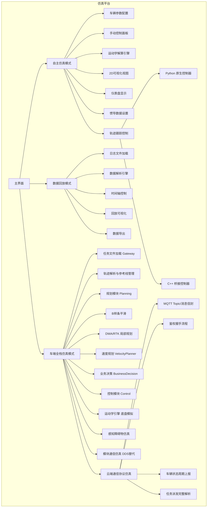
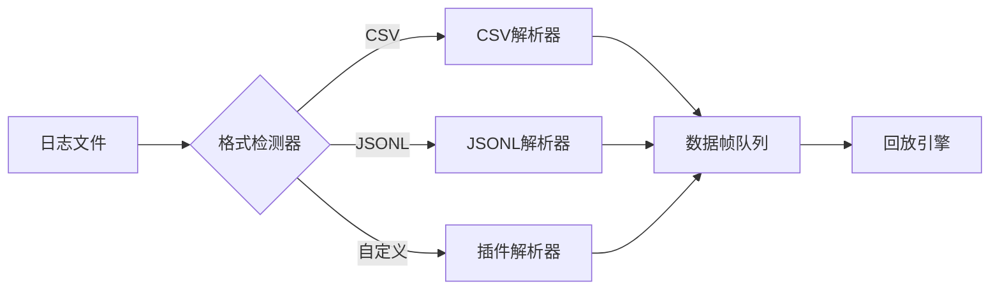
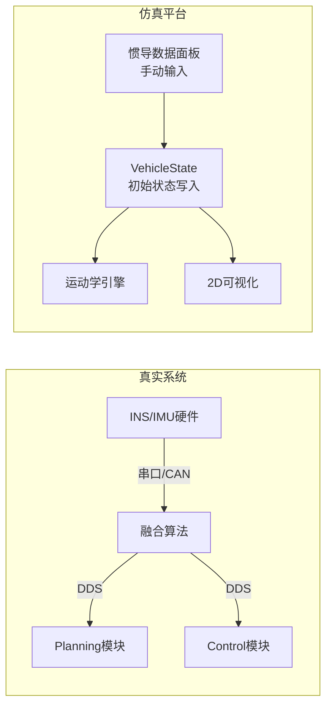
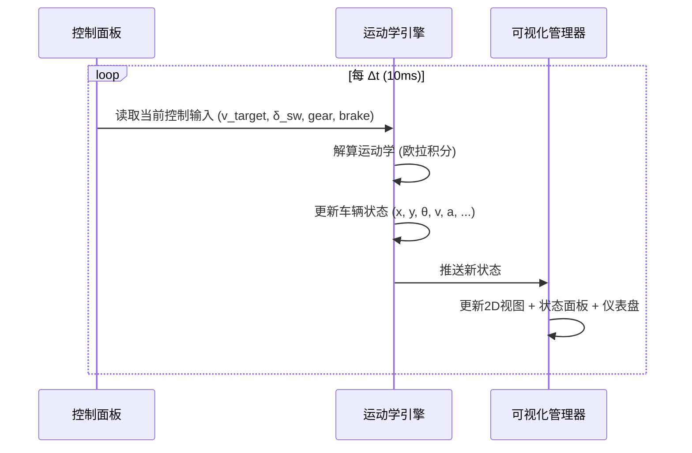
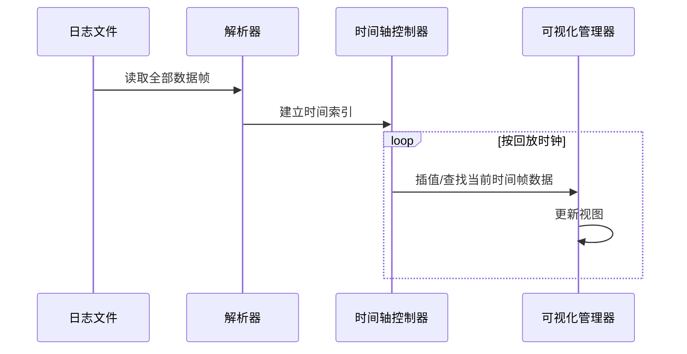
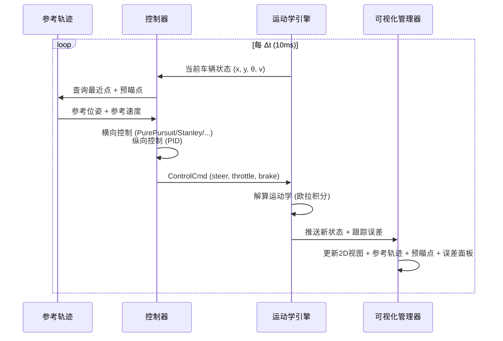
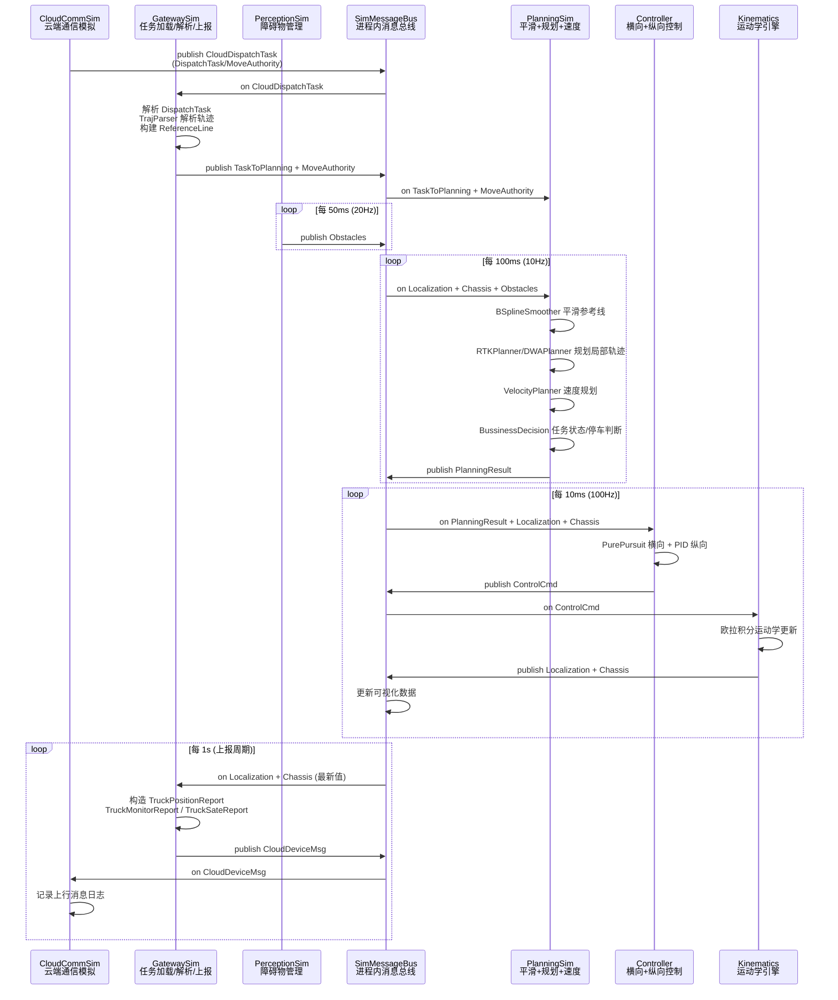

# 电动宽体车无人驾驶仿真测试平台 — 需求文档

> 版本：V1.7  
> 日期：2026-05-26  
> 状态：待审阅  
> 编制依据：
> - 《电动宽体车无人驾驶测试大纲——规划控制模块 v0.3》
> - 《电动宽体车无人驾驶技术方案 v0.5》
> - GB/T 38893-2020《矿山车辆安全监控系统技术规范》
> - GB/T 38124-2019《远程控制工业车辆 安全要求》
> - 测试用例集-决策+规划篇 v0.2

---

## 目录

1. [项目概述](#1-项目概述)
2. [功能需求](#2-功能需求)
3. [车辆运动学模型](#3-车辆运动学模型)
4. [车辆参数体系](#4-车辆参数体系)
5. [人机交互与可视化](#5-人机交互与可视化)
6. [外部数据接口](#6-外部数据接口)
7. [仿真模式设计](#7-仿真模式设计)
8. [C++ 控制模块桥接](#8-c-控制模块桥接)
    - 8.10 [技术集成方案审查](#810-技术集成方案审查-v16-新增)
9. [测试用例映射](#9-测试用例映射)
10. [技术架构](#10-技术架构)
11. [非功能需求](#11-非功能需求)
12. [附录](#12-附录)

---

## 1. 项目概述

### 1.1 项目背景

本项目旨在构建一套面向电动宽体矿用卡车（以下简称"矿卡"）的**仿真测试平台**，用于验证无人驾驶规划控制模块的核心功能。平台需支撑两种工作模式：

- **自主仿真模式**：不依赖外部数据源，由操作人员手动设定车辆控制输入（车速、方向盘转角、档位、制动压力等），平台通过运动学模型实时解算车辆位姿，并以可视化方式呈现。
- **数据回放模式**：接收外部日志文件（.log 格式），解析其中的车辆状态/控制/感知/规划数据流，按时间序列驱动仿真回放，用于离线分析与问题复现。

### 1.2 核心目标

| 目标 | 描述 |
|------|------|
| **运动学仿真** | 基于自行车模型（Bicycle Model）或阿克曼转向模型，实时计算车辆位姿 $(x, y, \theta)$ |
| **可视化呈现** | 提供 2D 俯视地图视图与仪表盘视图，实时展示车辆运动状态 |
| **人机交互** | 支持方向盘转角、车速、档位、制动压力的手动/滑动调节 |
| **数据回放** | 支持 .log 文件解析、时间轴控制（播放/暂停/快进/快退/倍速） |
| **车端全栈仿真** | 在仿真平台内复现 Gateway → Planning → Control 完整车端软件流程，各模块通过进程内通信串联，使用与实车一致的 C++ 算法代码 |
| **参数化配置** | 所有车辆物理参数、仿真参数可配置化 |
| **测试覆盖** | 覆盖测试用例集中可仿真的用例场景 |

### 1.3 适用范围

- 决策层功能验证（A1 数据隔离、A2 路权控制、A3 任务状态切换）
- 规划层功能验证（A4 参考线平滑、A5 轨迹规划 DP+QP）
- 泊车规划验证（A6 Hybrid A\*+RSP）
- 车辆动力学边界条件验证
- 操作人员培训与演示

---

## 2. 功能需求

### 2.1 功能全景图



### 2.2 功能清单

#### 2.2.1 车辆参数配置 (F-01)

| 编号 | 功能项 | 描述 | 优先级 |
|------|--------|------|--------|
| F-01-01 | 基本尺寸参数 | 轴距 L、车长、车宽、车高、轮距 | P0 |
| F-01-02 | 轴到边缘距离 | 前轴到前保险杠距离 $l_f$、后轴到后保险杠距离 $l_r$ | P0 |
| F-01-03 | 质心位置 | 前轴到质心距离 $a$、后轴到质心距离 $b$ | P0 |
| F-01-04 | 转向参数 | 转向传动比 $i_s$、最大前轮转角 $\delta_{max}$ | P0 |
| F-01-05 | 质量参数 | 空载质量、满载质量、最大载重 | P1 |
| F-01-06 | 制动参数 | 最大制动压力 $P_{max}$、制动压力-减速度映射曲线 | P1 |
| F-01-07 | 动力参数 | 最大驱动力/扭矩、最高车速、档位速比 | P2 |
| F-01-08 | 轮胎参数 | 轮胎半径、滚动阻力系数 | P2 |

#### 2.2.2 手动控制输入 (F-02)

| 编号 | 功能项 | 描述 | 优先级 |
|------|--------|------|--------|
| F-02-01 | 油门/车速控制 | 滑块或输入框设定目标车速（km/h），范围 0~30 km/h | P0 |
| F-02-02 | 方向盘转角控制 | 滑块或输入框设定方向盘转角（°），范围 $[-720°, +720°]$ | P0 |
| F-02-03 | 档位选择 | 按钮组 P / R / N / D | P0 |
| F-02-04 | 制动压力控制 | 滑块设定制动压力（MPa），范围 0~$P_{max}$ | P0 |
| F-02-05 | 组合控制 | 支持上述参数同时组合输入 | P1 |
| F-02-06 | 预设场景快捷设置 | 预设常用工况（如 15km/h 直行、R=15m 转弯等） | P2 |

#### 2.2.3 车辆状态显示 (F-03)

| 编号 | 功能项 | 描述 | 优先级 |
|------|--------|------|--------|
| F-03-01 | 位姿显示 | 实时显示 X, Y 坐标（m）、航向角 $\theta$（°） | P0 |
| F-03-02 | 速度显示 | 实时显示纵向速度 $v$（km/h）、横向速度 | P0 |
| F-03-03 | 加速度显示 | 纵向加速度 $a_x$（m/s²）、横向加速度 $a_y$ | P1 |
| F-03-04 | 方向盘/前轮转角 | 方向盘转角、前轮转角（°） | P0 |
| F-03-05 | 档位显示 | 当前档位 P/R/N/D | P0 |
| F-03-06 | 制动状态 | 制动压力、制动是否激活 | P1 |
| F-03-07 | 曲率/转弯半径 | 当前行驶轨迹曲率 $\kappa$、转弯半径 $R$ | P1 |
| F-03-08 | 横摆角速度 | Yaw rate（°/s） | P1 |

#### 2.2.4 2D 可视化视图 (F-04)

| 编号 | 功能项 | 描述 | 优先级 |
|------|--------|------|--------|
| F-04-01 | 车辆模型绘制 | 按实车比例绘制矿卡俯视图，含车身轮廓、驾驶室、前后保险杠、四轮（含转向可视化）、车头方向箭头、后轴中心标记（详见 5.3.1 车辆可视化细节） | P0 |
| F-04-02 | 行驶轨迹绘制 | 实时绘制车辆后轴中心点的历史轨迹线 | P0 |
| F-04-03 | 参考线/路径绘制 | 绘制规划层下发的参考线或规划路径 | P1 |
| F-04-04 | 地图网格/坐标轴 | 显示坐标网格、比例尺 | P1 |
| F-04-05 | 视角操作 | 支持平移、缩放、适应窗口 | P0 |
| F-04-06 | 障碍物绘制 | 显示静态/动态障碍物（数据回放模式下） | P1 |
| F-04-07 | 路权区域绘制 | 高亮显示路权起终点区域 | P2 |
| F-04-08 | 多车显示 | 支持同时显示多辆矿卡（数据回放模式） | P2 |

#### 2.2.5 惯导数据手动设置 (F-06)

在真实无人驾驶系统中，规划（Planning）与控制（Control）模块通过 DDS（Data Distribution Service）订阅来自惯导（INS/IMU）的定位数据，包括车辆位置、航向角、速度等信息，作为规划控制的输入基准。为模拟这一数据链路，仿真平台需提供惯导数据的手动设置功能，允许操作人员模拟 DDS 下发定位数据的场景，从而灵活配置车辆的初始位姿及运动状态。

| 编号 | 功能项 | 描述 | 优先级 |
|------|--------|------|--------|
| F-06-01 | 惯导位姿设置 | 手动输入车辆初始位置（X, Y, Z 坐标）及航向角（Yaw），模拟惯导定位数据下发 | P0 |
| F-06-02 | 惯导速度设置 | 手动输入初始纵向速度、横向速度，模拟惯导测速数据下发 | P1 |
| F-06-03 | 姿态角设置 | 手动输入 Roll（横滚角）、Pitch（俯仰角），模拟惯导姿态数据下发（矿卡场景中 Roll/Pitch 通常较小） | P2 |
| F-06-04 | 惯导数据一键应用 | 点击"应用"按钮后，将设置的惯导数据写入车辆初始状态，仿真以该位姿为起点开始运行 | P0 |
| F-06-05 | 惯导数据重置 | 一键清空惯导数据，恢复默认初始状态（原点位置，N档，静止） | P1 |
| F-06-06 | 当前位置捕获 | 一键捕获当前仿真车辆状态作为惯导数据，方便从当前位置重新设定起点 | P2 |
| F-06-07 | 惯导状态指示 | 显示惯导数据的有效状态（如定位类型、卫星数、定位精度等模拟状态），模拟真实惯导的数据健康监测 | P2 |

> **设计意图**：F-06 模拟的是规划/控制模块通过 DDS 接收 `LocalizationData` 或 `OdometryData` 消息的过程。在真实系统中，这一数据流由惯导硬件产生并经 DDS 中间件分发；在仿真平台中，由操作人员手动构造该数据帧，从而验证规划控制模块在不同起始位姿下的行为。

#### 2.2.6 C++ 控制模块桥接 (F-07)

仿真平台当前使用 Python 原生重写的控制器（PurePursuit + PID）进行轨迹跟踪。为消除 Python 实现与 C++ 生产代码之间的同步维护成本，需将 WORKSPACE 工程中的 C++ 控制模块接入仿真平台，使之直接调用真实控制算法。

| 编号 | 功能项 | 描述 | 优先级 |
|------|--------|------|--------|
| F-07-01 | control 模块本地化 | 将 WORKSPACE 中的 C++ `control/` 模块代码复制到 SIM 工程目录下（`SIM/control/`），剥离 git 子模块依赖，作为仿真专用副本 | P0 |
| F-07-02 | C 薄封装层 | 在 `control/src/` 中新增 `c_bridge.h` / `c_bridge.cc`，导出 `extern "C"` 纯 C 函数接口，内部完成 C 结构体 ↔ Protobuf ↔ C++ Controller 的数据转换，消除 Python 侧对 Protobuf/DDS 的依赖 | P0 |
| F-07-03 | 共享库编译 | 编写 `control/build_bridge.sh`，仅编译控制器核心算法 + C 桥接层为 `libcontrol_bridge.so`，不链接 DDS（`ahmq_fastdds`）依赖 | P0 |
| F-07-04 | Python ctypes 封装 | 新增 `sim_platform/core/c_controller.py`，通过 `ctypes.CDLL` 加载 `.so`，将 C 结构体映射为 Python ctypes 类型，封装为与现有 `Controller` 抽象基类兼容的 `CBridgeController` | P0 |
| F-07-05 | 控制器类型选择 | 支持通过配置选择使用的 C++ 控制器类型（PurePursuit / Stanley / LQR / KinematicsMPC / DynamicsMPC），对应 `control_config.ini` 中的配置项 | P1 |
| F-07-06 | 参数同源配置 | Python 侧控制器参数（轴距、预瞄距离、PID 增益等）从 `SIM/control/config/control_config.ini` 读取，确保仿真参数与 C++ 生产代码一致 | P1 |
| F-07-07 | 降级回退 | 当 `libcontrol_bridge.so` 加载失败或不可用时，自动降级为 Python 原生控制器，仿真不中断 | P1 |
| F-07-08 | C++ 代码变更同步 | 当上游 C++ 控制模块代码更新时，仅需替换 `SIM/control/src/controller/` 目录并重新编译 `.so`，Python 侧接口不变 | P2 |

> **设计意图**：F-07 实现"一次编译，持续同步"。C++ 控制算法作为唯一真实源（Single Source of Truth），仿真平台通过 C 薄封装层调用同一份算法代码。当 C++ 端修复 bug 或调优参数后，仿真侧重新编译 `.so` 即可同步，无需手动维护两套控制器实现。

#### 2.2.7 数据回放功能 (F-05)

| 编号 | 功能项 | 描述 | 优先级 |
|------|--------|------|--------|
| F-05-01 | 日志文件加载 | 支持选择并加载 .log 文件，文件格式校验 | P0 |
| F-05-02 | 数据帧解析 | 按行/按帧解析日志数据，提取时间戳及各字段 | P0 |
| F-05-03 | 时间轴播放控制 | 播放 / 暂停 / 停止 | P0 |
| F-05-04 | 速度控制 | 0.5x / 1x / 2x / 4x / 8x 倍速播放 | P0 |
| F-05-05 | 进度拖动 | 拖动进度条跳转到任意时间点 | P0 |
| F-05-06 | 逐帧步进 | 单步前进/后退一帧 | P1 |
| F-05-07 | 数据表格视图 | 以表格形式展示当前帧全部字段值 | P1 |
| F-05-08 | 数据曲线视图 | 选中字段绘制时间序列曲线 | P2 |
| F-05-09 | 数据导出 | 将回放数据导出为 CSV | P2 |
| F-05-10 | 日志格式自动检测 | 自动识别不同版本的日志格式 | P2 |

---

#### 2.2.8 车端 Gateway 模块仿真 (F-08)

为在仿真平台内复现完整的车端软件流程，需将 Gateway 模块的核心逻辑（任务接收、轨迹文件解析、参考线下发）接入仿真平台。Gateway 在真实系统中的职责是作为"云端与车端的桥梁"，通过 MQTT 接收云平台下发的运输任务（DispatchTask），经 HTTP 下载任务轨迹文件，解析后通过 DDS 下发给 Planning 模块。在仿真平台中，MQTT/HTTP/DDS 等外部通信链路均需替换为本地模拟，但轨迹解析与任务管理逻辑保持一致。

| 编号 | 功能项 | 描述 | 优先级 |
|------|--------|------|--------|
| F-08-01 | 任务轨迹文件加载 | 支持从本地文件系统加载轨迹文件（CSV / 由 TrajParser 解析的 `.traj` 格式），替代云端 HTTP 下载流程；支持选择单个任务文件或批量加载多个任务文件 | P0 |
| F-08-02 | 轨迹文件格式解析 | 实现与 C++ `TrajParser` 等价的 Python 轨迹解析器，解析轨迹文件中的经纬度/航向/速度/档位/属性位（bits）信息，提取 `TaskTraj` 结构的所有字段（lat, lon, head, altitude, v, theta, s, planned_v） | P0 |
| F-08-03 | 参考线/任务管理 | 支持多段参考线（ReferenceLine）的加载与管理：TaskTraj → ReferenceLine 的转换，每条参考线包含轨迹点序列、行驶方向（前进/倒车）、属性标记；模拟 `Business` 类对多条参考线的索引与切换逻辑 | P0 |
| F-08-04 | 任务状态模拟 | 模拟 DispatchTask 中的任务状态机：任务下发 → 任务执行中 → 任务完成/中断；支持显示当前任务信息（任务ID、目标位置经纬度/航向、任务文件MD5、载重状态） | P1 |
| F-08-05 | 路权信息模拟 | 模拟 `MovemntAuthoritySend` 路权下发：设定路权起点（right_of_way_index）、停车点（stop_index），在仿真中可视化路权区域范围 | P1 |
| F-08-06 | 车辆状态上报模拟 | 模拟 Gateway 周期性向云端上报车辆状态的逻辑（位置上报 1s 周期、状态上报 10s 周期），在仿真中以日志/面板形式展示上报数据，不实际发送 MQTT；具体上报消息构造由 F-08-15 承载 | P2 |
| F-08-07 | 设备鉴权模拟 | 模拟设备 IMEI 注册与鉴权流程的本地简化版本（输入 IMEI → 模拟鉴权通过/失败），用于测试鉴权状态对任务接收的影响 | P2 |
| F-08-08 | tar.gz 文件解压 | 模拟 Gateway 下载 tar.gz 后的解压流程：支持 `.tar.gz` 格式解压（zlib），提取内部文件到同名目录，自动定位 `.traj` 轨迹文件和高精地图文件 | P0 |
| F-08-09 | 高精地图文件管理 | 模拟高精地图文件（map.tar.gz）的下载和存储流程：支持加载地图文件、管理地图文件路径（`map_file_folder`）、校验地图文件 MD5 | P1 |
| F-08-10 | traj 文件完整字段解析 | 按真实格式解析 17 列 CSV 轨迹数据：`$` 起始标记、road_id、heading、lat、lon、y、x、altitude、spd、left_dis、right_dis、attribute_1(7位标志)、slope、curvature、attribute_2、overtake_left_dis、overtake_right_dis；跳过首列和尾列的 `$` 标记和索引 | P0 |
| F-08-11 | 属性位标志解析 | 解析 `attribute_1` 的 7 个位标志：is_re_park(重停车)、is_lift_forward(举升前行)、is_park(停车点)、has_right_wall(右侧挡墙)、has_left_wall(左侧挡墙)、**is_reverse(倒车/参考线拆分关键标志)**、is_preview(预瞄点)；解析 `attribute_2` 的 8 个保留位 | P0 |
| F-08-12 | 动作序列解析 | 解析 DispatchTask 中的 Action 序列：支持 4 种动作类型（STOP_ACTION=1 停车、LOAD_ACTION=2 装载、DUMP_ACTION=3 卸载、LIFT_ACTION=4 举升），每个动作包含目标点坐标（longitude, latitude, heading），发布到 Planning 模块执行 | P1 |
| F-08-13 | 任务类型与指令类型枚举 | 支持完整的任务类型枚举（LOAD=1 装载, UNLOAD=2 卸载, PARKING=3 泊车, DIG=4 挖掘, TEST=5 测试, TEMPORARY_PARKING=6 临时停车, ADD_OIL=7 加油, NO_GOODS=8 空载, SUPPLY_ENERGY=9 补能, PULLOVER_PARKING=10 靠边停车）和指令类型枚举（TO_WORK_AREA_QUEUE=1, TO_WAIT_PARK_SPACE=2, TO_PARK_SPACE=3, TASK_COOPERATE=4, HALF_LOADED_EXIT=5） | P1 |
| F-08-14 | SimMessageBus 数据订阅 | GatewaySim 通过 SimMessageBus 订阅以下 Topic：`CloudDispatchTask`（接收云端下发的 DispatchTask/MoveAuthority/ServerParamsQuery 等消息，替代真实 MQTT 下行订阅）、`Localization`（获取车辆当前位置/航向/速度，用于构造 1s 周期的 TruckPositionReport 上报消息）、`Chassis`（获取档位/制动/发动机转速等底盘数据，用于构造 TruckMonitorReport 和 TruckSateReport） | P0 |
| F-08-15 | 周期性上报消息构造 | 基于订阅到的 Localization 和 Chassis 数据，按真实周期构造上行 Protobuf 消息：每 1s 构造 `TruckPositionReport`（34 字段，位置/速度/任务状态/信号强度等）、每 1s 构造 `TruckMonitorReport`（12 字段，位置/横向误差/油门/制动百分比/限速等）、每 10s 构造 `TruckSateReport`（12 字段，前轮转角/机油压力/冷却液温度/电池电压/累计里程/举升角度等）；构造后的消息通过 SimMessageBus 发布到 `CloudDeviceMsg` topic，供 CloudCommSim 消费并记录日志 | P1 |

> **设计意图**：F-08 模拟的是 Gateway 在车端的"北向接口"（对云端）核心逻辑。仿真平台不实际连接 MQTT Broker，而是将云端任务数据通过本地文件加载的方式注入，使仿真具备完整的"接收任务 → 执行任务"闭环能力。F-08-08~F-08-13 补充了轨迹文件的完整解析链路（tar.gz → traj → 17列CSV → 属性位解析 → 动作序列），确保仿真平台可以无损解析真实云端下发的任务文件。

#### 2.2.9 Planning 规划模块集成 (F-09)

将 C++ Planning 模块的规划算法（参考线平滑、局部轨迹规划、速度规划、碰撞检测、业务决策）接入仿真平台。Planning 模块在真实系统中通过 DDS 接收 Gateway 下发的任务轨迹和感知模块的障碍物数据，经规划计算后发布 PlanningResult 给 Control 模块。仿真平台需将 Planning 的核心算法集成进来，使仿真具备从参考线到局部轨迹的完整规划能力。

| 编号 | 功能项 | 描述 | 优先级 |
|------|--------|------|--------|
| F-09-01 | B 样条参考线平滑 | 实现与 C++ `BSplineSmoother` 等价的 Python 平滑器：对原始参考线轨迹点进行三次 B 样条平滑，按固定步长（0.2m）重采样，输出光顺的参考线 | P0 |
| F-09-02 | RTK 轨迹规划 | 实现与 C++ `RTKPlanner` 等价的规划器：将平滑后的参考线直接转为局部规划轨迹（含速度、航向），作为基准规划器；遇到障碍物时执行减速处理 | P0 |
| F-09-03 | DWA 局部轨迹规划 | 实现与 C++ `DWAPlanner` 等价的规划器：在速度空间 (v, ω) 中采样，模拟每条轨迹并评估代价（障碍物距离×100 + 参考线偏差×30 + 速度×10 + 航向×20），选出最优轨迹 | P1 |
| F-09-04 | 速度规划 | 实现与 C++ `VelocityPlanner` 等价的速度规划器：反向计算减速距离（保证精准停车），前向限速约束（过弯提前减速），终点速度强制置零 | P0 |
| F-09-05 | 碰撞检测 | 实现与 C++ `CollisionDetector` 等价的碰撞检测器：基于 SAT（分离轴定理）的凸多边形与轨迹线段碰撞检测，返回最短距离和碰撞位置 | P1 |
| F-09-06 | 业务决策逻辑 | 实现与 C++ `BussinessDecision` 等价的决策逻辑：当前任务完成检测（接近终点）、超时判断、停车判断（到达 stop_index） | P1 |
| F-09-07 | 轨迹坐标系转换 | 实现 WGS84 经纬度 ↔ 局部 ENU 坐标的双向转换（小范围墨卡托近似），支持车辆局部坐标系与全局坐标系的换算 | P0 |
| F-09-08 | Planning C++ 桥接 | 参照 F-07 方案，将 C++ Planning 模块（planner + smoother + collision_detector + business_decision）编译为 `libplanning_bridge.so`，通过 ctypes 供仿真平台调用，Python 侧实现同等接口的 `PlanningBridge` 封装类 | P2 |
| F-09-09 | SimMessageBus 数据订阅 | PlanningSim 通过 SimMessageBus 订阅以下 Topic 以替代真实 DDS 输入：`Localization`（获取车辆当前位置/航向/速度，用于定位在参考线上的进度）、`Chassis`（获取当前档位/制动状态，用于规划约束判断）、`Obstacles`（获取障碍物列表，用于 DWA 避障规划和碰撞检测）、`MoveAuthority`（获取路权起终点索引，用于停车判断）；各订阅回调将最新数据缓存到 `Frame` 中，plan() 执行时从 `Frame` 读取 | P0 |

> **设计意图**：F-09 将 Planning 模块的三大核心职责（平滑 → 规划 → 速度分配）完整纳入仿真。优先级上，参考线平滑 + RTK 规划 + 速度规划为 P0（构成基本规划闭环），DWA + 碰撞检测为 P1（增强避障能力），C++ 桥接为 P2（长期目标，先以 Python 实现验证逻辑正确性）。

#### 2.2.10 车端全栈流程串联 (F-10)

将 Gateway → Planning → Control → 底盘（运动学引擎）四个环节在仿真平台内串联为完整的车端软件闭环，实现"加载任务文件 → 解析参考线 → 平滑 → 规划局部轨迹 → 控制跟踪 → 运动学更新 → 位姿反馈"的端到端仿真流程。

| 编号 | 功能项 | 描述 | 优先级 |
|------|--------|------|--------|
| F-10-01 | 全栈仿真主循环 | 新增 `FullStackEngine` 仿真引擎，在每个仿真步长（10ms）内依次执行：位姿更新 → 规划触发（按周期，如 100ms）→ 控制计算（每步）→ 运动学积分，模拟真实车端的周期性调度 | P0 |
| F-10-02 | 规划触发周期控制 | Planning 模块按可配置周期执行（默认 100ms / 10Hz），Control 模块每仿真步执行（100Hz），模拟真实系统中 Planning 和 Control 的不同运行频率 | P0 |
| F-10-03 | 数据传递链路 | 实现仿真平台内部的进程内数据传递：GateWaySim → TaskToPlanning → PlanningSim → PlanningResult → ControlSim/Controller → ControlCmd → Kinematics → VehicleState → (反馈回 PlanningSim 和 ControlSim) | P0 |
| F-10-04 | 全栈模式 UI 面板 | 新增"车端全栈仿真"控制面板：显示当前任务信息（任务ID、目标位置）、规划状态（当前规划器类型、参考线索引、规划耗时）、控制状态（横向/纵向控制器类型、当前控制指令）、流程状态指示（Gateway/Planning/Control 各模块健康灯） | P0 |
| F-10-05 | 模块独立启停 | 支持单独启用/禁用各模块：Gateway 模拟开关（使用任务文件/手动轨迹）、Planning 模拟开关（使用规划器/跳过直接用参考线）、Control 模块选择（Python/C++ 桥接/手动控制） | P1 |
| F-10-06 | 端到端延迟测量 | 测量并显示从"参考线输入"到"控制指令输出"的端到端延迟（模拟真实系统的规划控制延迟），包含规划耗时 + 控制耗时 + 通信开销 | P2 |
| F-10-07 | 故障注入模拟 | 支持模拟各模块的故障场景：参考线中断（模拟 DDS 超时）、感知数据缺失（障碍物列表为空）、定位跳变（模拟惯导异常），验证下游模块的故障处理逻辑 | P2 |

> **设计意图**：F-10 是本需求的核心目标——将三个原本通过 DDS 异步通信的独立 C++ 进程，在仿真平台内以同步/异步进程内调用的方式串联，使仿真平台具备"加载一个任务文件，自动完成从参考线到车辆行进的完整仿真"的能力。

#### 2.2.11 模块间通信仿真 (F-11)

真实车端系统中，Gateway / Planning / Control 三个模块之间通过 DDS（Data Distribution Service）以发布/订阅模式交换数据。仿真平台运行在单个 Python 进程中，需设计一套轻量级的进程内通信机制来替代 DDS，保持各模块间的数据接口与真实系统一致。

| 编号 | 功能项 | 描述 | 优先级 |
|------|--------|------|--------|
| F-11-01 | 仿真消息总线 | 设计 `SimMessageBus` 消息总线类，支持命名的 Topic 注册（字符串标识，对应 DDS topic 名）、发布（publish）和订阅（subscribe）操作，基于 Python 的 dict + callback 实现，单进程内零拷贝数据传递 | P0 |
| F-11-02 | 消息类型映射 | 定义仿真平台内部的 Python 数据类（dataclass）与各 DDS Topic 消息体的映射关系，共 8 个 Topic：**下行** — `CloudDispatchTask`（Cloud → Gateway，模拟 MQTT 下行消息）、`TaskToPlanning`（Gateway → Planning）、`MoveAuthority`（Gateway → Planning）；**内层** — `PlanningResult`（Planning → Control）、`ControlCmd`（Control → Chassis）；**上行** — `Localization`（Chassis/Kinematics → Planning, Control, Gateway）、`Chassis`（Chassis/Kinematics → Planning, Control, Gateway）、`Obstacles`（Perception → Planning） | P0 |
| F-11-03 | 发布周期控制 | 各消息发布按真实频率模拟：Localization/Chassis 每 10ms（100Hz）、PlanningResult 每 100ms（10Hz）、ControlCmd 每 10ms（100Hz）、Obstacles 每 50ms（20Hz）、CloudDispatchTask/MoveAuthority 事件驱动（任务派发/路权下发时立即发布）、CloudDeviceMsg 每 1s（位置/监控上报）和每 10s（状态上报）；所有周期可配置 | P1 |
| F-11-04 | 消息延迟模拟 | 支持为各 Topic 配置模拟传输延迟（ms 级），模拟真实 DDS 网络的异步传输延迟，用于验证 Planning/Control 对数据延迟的容忍度 | P2 |
| F-11-05 | 消息日志记录 | 记录所有消息总线的发布/订阅活动到仿真日志，支持按 Topic 过滤和时间范围查询，便于离线分析各模块间的数据交互时序 | P2 |

> **设计意图**：F-11 用约 200 行 Python 代码的 `SimMessageBus` 替代完整的 DDS 中间件，在保持数据接口语义一致的前提下，使仿真平台可以在不安装 FastDDS / CycloneDDS 的环境中运行。各模块通过总线解耦，与真实系统的架构模式保持一致。

#### 2.2.12 感知障碍物仿真 (F-12)

真实系统中，Planning 模块通过 DDS 订阅感知融合模块（Perception）输出的障碍物列表（`DDS_SensorFuseResults` / `perception::Obstacles`），作为局部轨迹规划的避障依据。仿真平台需提供障碍物的手动定义与可视化能力，使 DWA 规划器和碰撞检测逻辑有数据可消费。

| 编号 | 功能项 | 描述 | 优先级 |
|------|--------|------|--------|
| F-12-01 | 静态障碍物放置 | 支持在 2D 地图视图上通过鼠标点击放置静态障碍物，每个障碍物为矩形包围盒（可设长/宽），自动转换为感知模块输出的 `Obstacle` 数据结构（含中心经纬度、包围盒角点列表、类型、速度=0） | P0 |
| F-12-02 | 障碍物列表管理 | 提供障碍物列表面板：显示当前场景中所有障碍物的 ID、类型、位置、尺寸，支持选中/编辑/删除 | P0 |
| F-12-03 | 障碍物可视化 | 在 2D 地图视图中以红色半透明矩形绘制所有障碍物及其包围盒，碰撞时高亮显示碰撞对象 | P0 |
| F-12-04 | 动态障碍物模拟 | 支持为障碍物设置初始位置、速度和运动方向（匀速直线运动），仿真中障碍物按设置的速度和方向自动更新位置，模拟道路上的移动车辆/行人 | P1 |
| F-12-05 | 障碍物场景预设 | 预定义常用测试场景的障碍物布局：单车阻塞（1 个障碍物挡在参考线上）、窄道会车（对向 1 个动态障碍物）、多障碍物绕行（3+ 个散落障碍物） | P1 |
| F-12-06 | 感知数据发布模拟 | 每个仿真周期将当前障碍物列表通过 `SimMessageBus` 以 `Obstacles` Topic 发布（默认 50ms / 20Hz），供 Planning 模块订阅，模拟真实感知模块的 DDS 数据输出 | P0 |

> **设计意图**：F-12 用人工放置的障碍物替代真实感知模块（激光雷达/相机/毫米波雷达融合）的输出，使 Planning 模块的避障规划逻辑在仿真环境中得到验证。障碍物数据结构与真实 DDS `DDS_SensorFuseResults` 中提取的 `perception::Obstacles` 保持一致。

#### 2.2.13 云端通信协议仿真 (F-13)

真实车端 Gateway 与云端 IoT 平台通过 MQTT 协议进行双向通信，使用 Protobuf 序列化消息体，以 `CloudMsg`（下行）和 `DeviceMsg`（上行）作为消息信封（oneof 联合体）。为在仿真平台中完整模拟"车端 ↔ 云端"的交互闭环，需对 MQTT 通信层的关键协议要素进行仿真，使仿真平台能够在本地复现完整的消息收发时序，并支持后续对接真实 MQTT Broker 进行半实物仿真。

| 编号 | 功能项 | 描述 | 优先级 |
|------|--------|------|--------|
| F-13-01 | MQTT Topic 结构仿真 | 实现 3 个订阅 Topic（`down/truck/{imei}` 通用指令下发、`/retain/down/status/truck/{imei}` 保留消息-状态、`/retain/down/dispatch/task/truck/{imei}` 保留消息-任务派发）和 1 个发布 Topic（`up/truck/{imei}` 数据上报），QoS=0，支持 Retained 消息语义 | P0 |
| F-13-02 | CloudMsg 消息信封 | 实现下行消息的 Protobuf `CloudMsg` 信封解析，支持 oneof 消息类型识别：`commonResult`（通用结果）、`authenticationApply`（鉴权应答）、`truckStatus`（车辆状态指令）、`dispatchTask`（任务派发）、`serverParamsQueryResponse`（参数查询应答）、`movemntAuthoritySend`（路权下发） | P0 |
| F-13-03 | DeviceMsg 消息信封 | 实现上行消息的 Protobuf `DeviceMsg` 信封构造，支持 oneof 消息类型封装：`authentication`（鉴权请求，field 35）、`serverParamsQuery`（参数查询，field 9）、`truckPositionReport`（位置上报，field 29）、`truckMonitorReport`（监控上报，field 30）、`truckSateReport`（状态上报，field 31）、`stopObstacleInfo`（障碍物上报，field 45） | P0 |
| F-13-04 | 鉴权握手流程仿真 | 完整模拟 MQTT 连接 → 鉴权握手 → 鉴权应答的三步流程：(1) MQTT Broker 连接（username=crcc_cloud, password, clientId=device_{imei}, keepAlive=60s）；(2) 每 5s 发布 `DeviceMsg.authentication{authCode=IMEI}` 到 `up/truck/{imei}`；(3) 接收 `CloudMsg.authenticationApply{flowId, replyId, resultCode, deviceName, mode, projectId}`，resultCode=0 则鉴权通过，提取 `projectId` 用于后续 HTTP 请求签名；鉴权失败则持续重试 | P0 |
| F-13-05 | DispatchTask 完整消息解析 | 解析云端下发的 `DispatchTask` 消息全部字段：(1) `taskSn` 任务流水号；(2) `taskType` 任务类型（9 种枚举）；(3) `dispatchResult` 派发结果；(4) `dispatchTarget{targetName, targetElementId, targetType}` 目标信息；(5) `Command{commandType(5种), commandTargetName, path(任务文件名), fileMd5, actionSeq[]}` 指令序列；(6) `Action{actionType(4种), toPoint{longitude, latitude, heading}}` 动作定义。解析后自动触发后续的任务文件加载和轨迹解析流程 | P0 |
| F-13-06 | 车辆位置上报 (TruckPositionReport) | 模拟 1s 周期的位置上报消息构造，包含全部 34 个字段：battery(电池电量)、batteryCapacity(电池容量)、materialCode(物料编码)、longitude/latitude/altitude(位置)、direction(航向)、speed(速度)、forwardAcceleration/lateralAcceleration/yawAngularAcceleration(加速度)、roadId(车道ID)、pointIndex(当前点索引)、roadResidualDistance(剩余距离)、operationType/reasonCode/runState/stopReason(运行状态)、taskSn/taskType/taskStatus/commandType/actionType/actionStatus(任务状态)、utcMilliSeconds(时间戳)、currentPathName/curAreaBoundaryName(文件名)、status(StatusType 28位状态字)、speedDeviation(速度偏差)、subMachineState(子状态机)、detourStatus(绕行状态)、isAgileObstacle(敏捷避障)、autoExitReasons(退出自动驾驶原因)、wirelessSignal(信号强度RSSI) | P1 |
| F-13-07 | 车辆监控上报 (TruckMonitorReport) | 模拟 1s 周期的监控上报消息构造，包含全部 12 个字段：longitude/latitude/altitude(位置)、direction(航向)、speed(速度)、lateralError(横向误差)、spin(发动机转速RPM)、throttleOpenAuto/throttleOpenManual(自动/手动油门%)、brakeOpenAuto/brakeOpenManual(自动/手动制动%)、limitSpeed(地图限速) | P1 |
| F-13-08 | 车辆状态上报 (TruckSateReport) | 模拟 10s 周期的状态上报消息构造，包含全部 12 个字段：longitude/latitude/altitude(位置)、direction(航向)、frontWheelDirection(前轮转角)、frontWheelAngularError(转角误差)、oilPressure(机油压力)、coolantTemperature(冷却液温度)、batteryVoltage(电池电压)、fuelLevel(燃油/电量)、mileage(累计里程)、liftAngle(举升角度) | P1 |
| F-13-09 | 服务器参数查询流程 | 模拟鉴权通过后的服务器参数查询流程：(1) 构造 `DeviceMsg.serverParamsQuery{}` 并发布；(2) 接收 `CloudMsg.serverParamsQueryResponse{flowId, contentLength, list[{id, length, content}]}`；(3) 解析关键参数：`0xF000`(地图文件名)、`0xF001`(地图MD5)、`0xF002`(文件下载URL)；解析成功后自动触发地图文件下载 | P1 |
| F-13-10 | HTTP 下载鉴权 | 模拟 Gateway 下载文件时的 HTTP 鉴权机制：生成 `timestamp`(Unix秒)、`sign`(MD5("crccAuthentication"+timestamp))、`projectid`(来自鉴权应答) 三个请求头，支持在仿真日志中展示和校验完整的 HTTP 请求签名 | P1 |
| F-13-11 | 感知障碍物上报 (StopObstacleInfo) | 模拟 Gateway 将感知融合数据（DDS `DDS_SensorFuseResults`）转换为 `StopObstacleInfo` 并通过 MQTT 上传的流程：遍历障碍物包围盒的 4 个角点，调用 `relativeToGlobal()` 将相对坐标转为 WGS84 经纬度，构造 `DeviceMsg.stopObstacleInfo{ts, stopTs, impactType, currentPose, impactPose, impactObstacle[]}` 并发布 | P2 |
| F-13-12 | MQTT 连接管理 | 模拟 MQTT 连接生命周期：connect(超时 5s)、disconnect、自动重连(间隔 10s)、连接状态指示灯；支持配置 Broker 地址/端口/用户名/密码/IMEI，为后续对接真实 MQTT Broker 进行半实物仿真预留接口 | P1 |
| F-13-13 | 消息日志与监控 | 记录所有 MQTT Topic 的收发历史到仿真日志：时间戳、Topic 名、消息类型（CloudMsg oneof case / DeviceMsg oneof case）、消息体关键字段摘要、QoS、是否 Retained；支持按 Topic 过滤和时间范围查询，便于分析云端与车端的完整交互时序 | P2 |

> **设计意图**：F-13 将 Gateway 与云端的 MQTT 通信层完整纳入仿真范围。当前阶段（V1.5），仿真平台以"本地模拟"方式构造和消费这些消息（不实际连接 MQTT Broker），但消息格式、字段、时序完全遵循真实 Protobuf 协议，确保逻辑验证的保真度。F-13-12 预留了 MQTT Broker 对接接口，未来可直接切换到真实 MQTT 连接进行半实物仿真。
>
> **与 F-08 的关系**：F-08 关注 Gateway 的"数据处理链路"（文件加载 → 轨迹解析 → 参考线管理），F-13 关注 Gateway 的"通信协议层"（MQTT Topic → 消息信封 → 鉴权握手 → 周期性上报 → 任务派发）。两者共同构成完整的 Gateway 仿真能力。

---

## 3. 车辆运动学模型

### 3.1 模型选择

采用 **阿克曼转向运动学模型**（自行车模型），适用于中低速工况（矿卡典型行驶速度 ≤30 km/h，忽略轮胎侧偏）。

### 3.2 状态变量

| 符号 | 含义 | 单位 |
|------|------|------|
| $x$ | 车辆后轴中心全局 X 坐标 | m |
| $y$ | 车辆后轴中心全局 Y 坐标 | m |
| $\theta$ | 车辆航向角（与 X 轴夹角，逆时针为正） | rad |
| $v$ | 后轴中心纵向速度 | m/s |
| $\delta$ | 前轮转角（左转为正） | rad |

### 3.3 连续时间运动学方程

$$
\begin{cases}
\dot{x} = v \cdot \cos\theta \\
\dot{y} = v \cdot \sin\theta \\
\dot{\theta} = \dfrac{v}{L} \cdot \tan\delta
\end{cases}
$$

其中 $L$ 为轴距（m）。

### 3.4 离散时间递推（欧拉积分）

取仿真步长 $\Delta t$（默认 0.01s，即 100Hz）：

$$
\begin{aligned}
x_{k+1} &= x_k + v_k \cdot \cos\theta_k \cdot \Delta t \\
y_{k+1} &= y_k + v_k \cdot \sin\theta_k \cdot \Delta t \\
\theta_{k+1} &= \theta_k + \frac{v_k}{L} \cdot \tan\delta_k \cdot \Delta t
\end{aligned}
$$

### 3.5 输入量映射

#### 3.5.1 方向盘转角 → 前轮转角

$$
\delta = \frac{\delta_{sw}}{i_s}
$$

- $\delta_{sw}$：方向盘转角（°）
- $i_s$：转向传动比（无量纲）
- $\delta$ 限幅：$|\delta| \leq \delta_{max}$

#### 3.5.2 车速 → 纵向速度

- 用户设定目标车速 $v_{target}$（km/h），转为 m/s
- 采用一阶惯性环节平滑过渡（模拟车辆纵向动力学响应）：

$$
v_{k+1} = v_k + \frac{v_{target} - v_k}{\tau_v} \cdot \Delta t
$$

- $\tau_v$：速度响应时间常数（可配置，默认 0.5s）

#### 3.5.3 制动压力 → 减速度

- 简化线性模型：$a_{brake} = k_b \cdot P_{brake}$
- $k_b$：制动增益系数（m/s²/MPa）
- 作用于当前速度：$v_{k+1} = v_k - a_{brake} \cdot \Delta t$（限幅 $v \geq 0$）

#### 3.5.4 档位

| 档位 | 含义 | 对运动学的影响 |
|------|------|----------------|
| P | 驻车 | $v = 0$，锁止 |
| R | 倒车 | $v < 0$（符号取反） |
| N | 空档 | $v$ 由惯性+阻力决定（可简化） |
| D | 前进 | $v \geq 0$ |

### 3.6 模型扩展（可选）

- **前轴中心为参考点**：$x_f = x + L\cos\theta$, $y_f = y + L\sin\theta$
- **质心为参考点**：$x_{cg} = x + b\cos\theta$, $y_{cg} = y + b\sin\theta$
- **考虑侧偏角**（高速扩展）：需引入侧偏刚度参数（V2 阶段）

---

## 4. 车辆参数体系

### 4.1 参数默认值（参考电动宽体矿卡典型参数）

| 参数名称 | 符号 | 默认值 | 单位 | 可配置 |
|----------|------|--------|------|--------|
| 轴距 | $L$ | 4.2 | m | ✅ |
| 车长 | $L_{veh}$ | 9.5 | m | ✅ |
| 车宽 | $W_{veh}$ | 3.7 | m | ✅ |
| 车高 | $H_{veh}$ | 4.0 | m | ✅ |
| 前轮距 | $T_f$ | 2.8 | m | ✅ |
| 后轮距 | $T_r$ | 2.8 | m | ✅ |
| 前轴到前保险杠距离 | $l_f$ | 1.2 | m | ✅ |
| 后轴到后保险杠距离 | $l_r$ | 1.1 | m | ✅ |
| 前轴到质心距离 | $a$ | 2.1 | m | ✅ |
| 后轴到质心距离 | $b$ | 2.1 | m | ✅ |
| 转向传动比 | $i_s$ | 20:1 | — | ✅ |
| 最大前轮转角 | $\delta_{max}$ | 35 | ° | ✅ |
| 空载质量 | $m_{empty}$ | 30000 | kg | ✅ |
| 满载质量 | $m_{full}$ | 95000 | kg | ✅ |
| 最大制动压力 | $P_{max}$ | 10 | MPa | ✅ |
| 制动增益系数 | $k_b$ | 0.5 | m/s²/MPa | ✅ |
| 最高车速 | $v_{max}$ | 30 | km/h | ✅ |
| 最小转弯半径 | $R_{min}$ | 15 | m | ✅ |
| 轮胎滚动半径 | $r_{tire}$ | 0.85 | m | ✅ |
| 速度响应时间常数 | $\tau_v$ | 0.5 | s | ✅ |

### 4.2 参数存储与加载

- 默认参数内置于代码中
- 支持从 JSON/YAML 配置文件加载自定义参数
- 支持运行时动态修改参数（仿真暂停状态下）

---

## 5. 人机交互与可视化

### 5.1 整体布局方案

```
┌──────────────────────────────────────────────────┐
│  菜单栏 / 工具栏                                   │
│  [模式切换] [参数配置] [日志加载] [帮助]             │
├──────────┬───────────────────────┬────────────────┤
│          │                       │  车辆状态面板    │
│  控制面板 │    2D 地图视图        │  ┌────────────┐ │
│          │   (俯视可视化)        │  │ 速度 (km/h) │ │
│ ┌──────┐ │                       │  │ 航向角 (°)  │ │
│ │速度控制│ │                       │  │ 档位        │ │
│ │      │ │                       │  │ 坐标 (x,y)  │ │
│ │──────│ │                       │  │ 转角 (°)    │ │
│ │转角控制│ │                       │  │ 制动 (MPa)  │ │
│ │      │ │                       │  │ ...         │ │
│ │──────│ │                       │  └────────────┘ │
│ │档位选择│ │                       │                │
│ │      │ │                       │  惯导数据面板    │
│ │──────│ │                       │  ┌────────────┐ │
│ │制动控制│ │                       │  │ X / Y / Z  │ │
│ │      │ │                       │  │ Yaw (°)    │ │
│ │──────│ │                       │  │ Vx / Vy    │ │
│ │惯导设置│ │                       │  │ [应用][重置]│ │
│ └──────┘ │                       │  └────────────┘ │
├──────────┴───────────────────────┴────────────────┤
│  状态栏 / 回放时间轴（数据回放模式）                  │
└──────────────────────────────────────────────────┘
```

### 5.2 控制面板

- **车速控制**：水平滑块 + 数值输入框，范围 0~30 km/h，步进 0.1
- **方向盘转角控制**：水平滑块 + 数值输入框，范围 -720°~+720°，步进 1°
- **档位选择**：4 个互斥按钮 P / R / N / D，高亮当前档位
- **制动压力控制**：垂直滑块 + 数值输入框，范围 0~10 MPa，步进 0.1
- **急停按钮**：醒目红色按钮，一键将车速置 0、制动压力置最大

### 5.3 2D 地图视图

- **坐标系**：ENU（East-North-Up）右手坐标系
  - X 轴指向东（右），Y 轴指向北（上）
  - 航向角 $\theta$ 以 X 轴正向为 0°，逆时针为正
- **比例尺**：左下角显示当前比例尺
- **车辆图标**：按实际尺寸比例绘制的矿卡俯视图（基于 `VehicleParams` 中全部尺寸参数），包含以下元素：

#### 5.3.1 车辆可视化细节

车辆模型基于以下参数按比例绘制（参数来源详见第 4 章）：

| 绘制元素 | 参数依据 | 颜色 | 说明 |
|----------|----------|------|------|
| **车身轮廓** | `length` × `width` | 绿色边框 + 半透明填充 | 以车宽/车长绘制矩形轮廓，后轴中心为坐标参考点 |
| **驾驶室** | `wheelbase` × `width` | 亮绿边框 + 浅填充 | 位于车身前部，约占轴距 55% 的区域 |
| **前保险杠** | `front_overhang` | 红橙色 (#ff503c) | 车身最前端粗线标记 |
| **后保险杠** | `rear_overhang` | 灰色 (#9696a0) | 车身最后端粗线标记 |
| **左前轮** | `wheelbase`, `front_track`, `tire_radius` | 橙黄色矩形 | 前轴左侧，随前轮转角 $\delta$ 旋转 |
| **右前轮** | `wheelbase`, `front_track`, `tire_radius` | 橙黄色矩形 | 前轴右侧，随前轮转角 $\delta$ 旋转 |
| **左后轮** | `rear_track`, `tire_radius` | 灰白色矩形 | 后轴左侧，固定不转向 |
| **右后轮** | `rear_track`, `tire_radius` | 灰白色矩形 | 后轴右侧，固定不转向 |
| **车头方向箭头** | — | 亮绿色实心三角 | 从后轴中心指向车头方向 |
| **后轴中心点** | — | 亮绿色圆点 | 后轴中心坐标标记 |

**车轮绘制规则**：
- 车轮尺寸按轮胎半径 $r_{tire}$ 计算：轮长 $= 1.6 \times r_{tire}$，轮宽 $= 0.55 \times r_{tire}$
- 前轮（转向轮）绕各自中心旋转，转角 = 前轮转角 $\delta$
- 后轮（非转向轮）始终与车身纵轴平行
- 转向轮以**橙黄色**绘制，非转向轮以**灰白色**绘制
- 当 $|\delta| > 0.01$ rad 时，转向轮中心叠加十字方向线以增强转向可读性

- **轨迹线**：蓝色渐隐曲线，保留最近 N 个采样点（可配置，默认 5000 点）
- **网格**：浅灰色虚线网格，间距自适应

### 5.4 配色方案（深色主题）

| 元素 | 颜色 | 色值 |
|------|------|------|
| 背景 | 深灰蓝 | #1a1a2e |
| 面板背景 | 深蓝灰 | #16213e |
| 车辆边框 | 亮绿 | #0f3460 → #00ff88 |
| 轨迹线 | 青色 | #00d4ff |
| 网格线 | 半透明白 | rgba(255,255,255,0.08) |
| 文字 | 浅灰白 | #e0e0e0 |
| 高亮/警告 | 橙黄 | #ffaa00 |
| 危险/制动 | 红 | #ff4444 |

### 5.5 惯导数据设置面板

模拟真实系统中通过 DDS 接收惯导定位数据的交互面板，位于控制面板下方或状态面板下方区域。

- **位姿输入组**：
  - X 坐标：数值输入框，单位 m，范围不限制（由操作人员按场景设定）
  - Y 坐标：数值输入框，单位 m
  - Z / 海拔：数值输入框，单位 m，对应惯导输出的海拔高程（默认 0.0，矿卡场景通常为平面可忽略）
  - 航向角 Yaw：数值输入框，单位 °，范围 $[-180°, +180°]$
- **速度输入组**（可折叠，默认收起）：
  - 纵向速度 Vx：数值输入框，单位 m/s，范围 $[-30, 30]$
  - 横向速度 Vy：数值输入框，单位 m/s
- **姿态输入组**（可折叠，默认收起，P2 优先级）：
  - Roll（横滚角）：数值输入框，单位 °
  - Pitch（俯仰角）：数值输入框，单位 °
- **操作按钮**：
  - **[应用]** 按钮：将惯导数据写入车辆初始状态，仿真以该位姿为起始点运行
  - **[重置]** 按钮：清空所有惯导输入，恢复默认原点状态
  - **[捕获当前位置]** 按钮（P2）：从当前仿真状态回填惯导数据
- **状态指示**（P2）：
  - 定位类型指示灯（单点/差分/RTK/Fix）
  - 模拟卫星数显示
  - 定位精度估计（水平/垂直 DOP 模拟值）

> **交互约束**：惯导数据"应用"仅在仿真停止或暂停状态下可操作，运行中需锁定输入以防止状态跳变。

---

## 6. 外部数据接口

### 6.1 日志文件格式

由于当前无具体 log 文件格式定义，本平台设计为**格式可扩展架构**。

#### 6.1.1 最小必选字段（V1.0 支持）

| 字段名 | 类型 | 单位 | 描述 |
|--------|------|------|------|
| timestamp | float | s | 时间戳（相对于起始时间） |
| x | float | m | 车辆后轴中心 X 坐标 |
| y | float | m | 车辆后轴中心 Y 坐标 |
| theta | float | rad | 车辆航向角 |
| velocity | float | m/s | 纵向速度 |
| steer_angle | float | rad | 前轮转角 |
| gear | int | — | 档位 (0=P, 1=R, 2=N, 3=D) |
| brake_pressure | float | MPa | 制动压力 |

#### 6.1.2 扩展字段（V1.1+）

| 字段名 | 类型 | 单位 | 描述 |
|--------|------|------|------|
| acceleration_x | float | m/s² | 纵向加速度 |
| acceleration_y | float | m/s² | 横向加速度 |
| yaw_rate | float | rad/s | 横摆角速度 |
| ref_line_id | int | — | 参考线 ID |
| curvature | float | 1/m | 路径曲率 |
| path_points | array | — | 规划路径点序列 |
| obstacle_list | array | — | 障碍物列表 |
| task_state | int | — | 任务状态机状态 |
| fault_code | int | — | 故障码 |

#### 6.1.3 文件格式方案

**方案 A：CSV 格式**（推荐 V1.0 采用）
```csv
timestamp,x,y,theta,velocity,steer_angle,gear,brake_pressure
0.00,100.0,200.0,0.785,5.0,0.0,3,0.0
0.05,100.25,200.25,0.785,5.0,0.0,3,0.0
...
```

**方案 B：JSON Lines 格式**（V1.1 候选）
```json
{"ts": 0.00, "x": 100.0, "y": 200.0, "theta": 0.785, "v": 5.0, "steer": 0.0, "gear": 3, "brake": 0.0}
```

**方案 C：自定义二进制格式**（V2.0 考虑）

### 6.2 数据解析器架构



### 6.3 惯导定位数据接口（INS/DDS 模拟）

本节定义模拟 DDS 惯导定位数据的接口格式，供仿真平台手动设置及后续 DDS 桥接使用。

#### 6.3.1 惯导数据字段定义

在真实系统中，规划与控制模块通过 DDS 订阅 `LocalizationData` 话题，数据由惯导设备（INS/IMU + GNSS）融合产生。仿真平台参照该数据帧结构，提供以下可设置字段：

| 字段名 | 类型 | 单位 | 描述 | DDS 来源 |
|--------|------|------|------|----------|
| latitude | float64 | ° | 纬度（WGS84），用于UTM投影计算局部坐标 | GNSS |
| longitude | float64 | ° | 经度（WGS84） | GNSS |
| altitude | float64 | m | 椭球高 | GNSS |
| local_x | float64 | m | 局部 ENU 坐标系 X 坐标（东向） | 投影转换 |
| local_y | float64 | m | 局部 ENU 坐标系 Y 坐标（北向） | 投影转换 |
| local_z | float64 | m | 局部 ENU 坐标系 Z 坐标（天向） | 投影转换 |
| yaw | float64 | rad | 航向角（与正东夹角，逆时针为正） | INS 融合 |
| roll | float64 | rad | 横滚角 | INS |
| pitch | float64 | rad | 俯仰角 | INS |
| vel_north | float64 | m/s | 北向速度 | INS 融合 |
| vel_east | float64 | m/s | 东向速度 | INS 融合 |
| vel_up | float64 | m/s | 天向速度 | INS 融合 |
| ang_vel_roll | float64 | rad/s | 绕 X 轴角速度 | IMU |
| ang_vel_pitch | float64 | rad/s | 绕 Y 轴角速度 | IMU |
| ang_vel_yaw | float64 | rad/s | 绕 Z 轴角速度（Yaw rate） | IMU |
| gnss_status | int | — | 定位状态：0=无效, 1=单点, 2=差分, 3=RTK Fix, 4=RTK Float | GNSS |
| satellite_count | int | — | 可见卫星数 | GNSS |
| hdop | float64 | — | 水平精度因子 | GNSS |
| vdop | float64 | — | 垂直精度因子 | GNSS |
| timestamp | float64 | s | 定位数据时间戳 | 系统 |

#### 6.3.2 仿真平台中的简化处理

在 V1.0 仿真平台中，惯导数据接口简化为以下可直接设置的初始状态字段（采用 ENU 局部坐标系，与 §3 运动学模型使用的坐标系一致）：

| 字段名 | 类型 | 单位 | 映射到车辆状态 | 默认值 |
|--------|------|------|----------------|--------|
| local_x | float64 | m | VehicleState.x | 0.0 |
| local_y | float64 | m | VehicleState.y | 0.0 |
| local_z | float64 | m | 海拔高程，对应 INS 输出的 altitude（保留展示，V1.0 不参与运动学计算） | 0.0 |
| yaw | float64 | ° | VehicleState.theta | 0.0 |
| vel_east | float64 | m/s | VehicleState.v（合速度分解） | 0.0 |
| vel_north | float64 | m/s | （保留展示） | 0.0 |

> **经纬度与局部坐标的转换**：若操作人员输入的是经纬度（WGS84），平台内部可通过 UTM 投影或指定参考原点将其转换为局部 ENU 坐标后再设置车辆状态。V1.0 优先支持直接输入局部坐标。

#### 6.3.3 数据流向



真实系统中的 DDS `LocalizationData` → 仿真平台中由操作人员通过 UI 面板手动构造等效数据 → 写入 `VehicleState` 作为仿真起点。

---

## 7. 仿真模式设计

### 7.1 自主仿真模式



**仿真步长**：$\Delta t = 10\text{ms}$（100Hz），可通过配置文件调整。

### 7.2 数据回放模式



### 7.3 模式切换

- 自主仿真 → 数据回放：停止当前仿真，加载日志文件，初始化回放
- 数据回放 → 自主仿真：停止回放，恢复手动控制输入
- 切换时保留车辆参数配置

### 7.4 轨迹跟踪仿真模式

V1.3 新增轨迹跟踪仿真模式，支持两种控制器后端：



### 7.5 车端全栈仿真模式

V1.4 新增车端全栈仿真模式，V1.7 补全云端通信层和感知层数据流，在仿真平台内复现 Cloud → Gateway → Planning → Control → 底盘 + 感知 的完整车端软件流程。



**关键设计决策**：

| 决策点 | 真实车端系统 | 仿真平台 V1.7 |
|--------|-------------|---------------|
| 模块间通信 | DDS (FastDDS) 跨进程 | `SimMessageBus` 进程内回调，8 个 Topic |
| 云端下行 | MQTT (3 个订阅 Topic) + HTTP 下载 | `CloudCommSim` 发布 `CloudDispatchTask` 到 SimMessageBus → `GatewaySim` 订阅处理 |
| 云端上行 | MQTT (1 个发布 Topic) | `GatewaySim` 订阅 Localization/Chassis → 构造上报消息 → 发布 `CloudDeviceMsg` → `CloudCommSim` 消费日志 |
| 感知数据 | 激光雷达/相机/毫米波雷达融合 | `PerceptionSim` 管理障碍物，20Hz 发布到 SimMessageBus → `PlanningSim` 订阅 |
| 底盘反馈 | CAN Bus 实时数据 | 运动学引擎计算值，100Hz 发布 Localization + Chassis |
| 执行周期 | 各模块独立线程，DDS 异步 | 仿真主循环统一调度，各模块按各自频率从 SimMessageBus 读取缓存数据 |
| Planning 频率 | ~10Hz | 可配置 (默认 10Hz) |
| Control 频率 | ~100Hz | 每仿真步 (100Hz) |
| 路权管理 | 云端下发 MoveAuthority → DDS | `CloudCommSim` 下发 → `GatewaySim` → SimMessageBus `MoveAuthority` → `PlanningSim` 订阅 |

**模式切换逻辑**：

```
自主仿真 ←→ 数据回放 ←→ 车端全栈仿真
    ↓            ↓            ↓
 手动控制    日志驱动    Gateway→Planning→Control 闭环
```

三种模式之间可切换，切换时保留车辆参数配置。车端全栈仿真模式支持降级为自主仿真模式（关闭 Gateway 和 Planning，直接使用手动轨迹 + 控制器跟踪）。

### 7.6 模式功能对比

| 能力 | 自主仿真 | 数据回放 | 车端全栈仿真 |
|------|----------|----------|-------------|
| 手动控制车辆 | ✅ | ❌ | ❌（可选降级） |
| 控制器轨迹跟踪 | ✅ | ❌ | ✅ |
| 参考线平滑 | ❌ | ❌ | ✅ B样条 |
| 局部轨迹规划 | ❌ | ❌ | ✅ RTK/DWA |
| 速度规划 | ❌ | ❌ | ✅ VelocityPlanner |
| 障碍物/碰撞检测 | ❌ | 日志中已含 | ✅ SAT算法 |
| 任务文件加载 | ❌ | ❌ | ✅ TrajParser |
| 路权/业务决策 | ❌ | ❌ | ✅ BusinessDecision |
| 历史数据回放 | ❌ | ✅ | ❌ |

### 8.1 背景与目标

仿真平台当前使用 Python 原生实现的控制器（`core/controller.py`）进行轨迹跟踪。该实现独立于 WORKSPACE 中的 C++ 生产代码，存在以下问题：

| 问题 | 影响 |
|------|------|
| **双份实现** | PurePursuit / PID 算法在 C++ 和 Python 中各维护一份，修改需同步两处 |
| **参数漂移** | 控制器参数（预瞄距离、PID 增益等）硬编码在两处，容易不一致 |
| **新增控制器滞后** | Stanley / LQR / MPC 等 C++ 已有控制器，Python 侧尚未实现 |
| **验证不可信** | Python 控制器验证通过 ≠ C++ 生产代码行为一致 |

**目标**：仿真平台直接调用 C++ 控制模块的同一份算法代码，消除双份维护。

### 8.2 总体方案：C 薄封装层 + ctypes

```
┌──────────────────────────────────────────────────────────┐
│                    Python 仿真层                          │
│  sim_platform/core/c_controller.py                       │
│  class CBridgeController(Controller):                    │
│      def update(state, traj) → ControlCmd                │
│          lib.controller_update(handle, c_state, c_traj)  │
│          ↑                                               │
│          │  ctypes.CDLL("libcontrol_bridge.so")          │
├──────────────────────────────────────────────────────────┤
│              C 薄封装层 (c_bridge.cc)                     │
│  extern "C" {                                            │
│    void* controller_create(const char* type);            │
│    C_ControlCmd controller_update(                       │
│        void* handle, C_VehicleState*, C_TrajPoint*, n);  │
│  }                                                       │
│  内部: C struct → Protobuf → C++ Controller → C struct   │
├──────────────────────────────────────────────────────────┤
│            C++ 控制模块 (control/src/controller/)         │
│  PurePursuitController  / StanleyController              │
│  LQRController          / KinematicsMPCController         │
│  SpdPidController                                        │
└──────────────────────────────────────────────────────────┘
```

### 8.3 C 桥接接口定义

```c
// control/src/c_bridge.h

typedef struct {
    double x, y, heading, velocity, curvature;
} C_TrajectoryPoint;

typedef struct {
    double x, y, theta, v;
} C_VehicleState;

typedef struct {
    double steer_angle;       // 前轮转角 (deg)
    double target_velocity;   // 目标车速 (km/h)
    double throttle;          // 油门百分比 0-100
    double brake;             // 制动百分比 0-100
    double cross_track_error; // 横向偏差 (m)
    double heading_error;     // 航向偏差 (deg)
    double speed_error;       // 速度偏差 (km/h)
} C_ControlCmd;

// 创建控制器实例, type: "pure_pursuit" | "stanley" | "lqr" | "kinematics_mpc" | "dynamics_mpc"
void* controller_create(const char* type);

// 销毁控制器实例
void controller_destroy(void* handle);

// 执行一步控制计算
C_ControlCmd controller_update(void* handle,
                                const C_VehicleState* state,
                                const C_TrajectoryPoint* trajectory,
                                int trajectory_length);

// 重置控制器内部状态
void controller_reset(void* handle);
```

### 8.4 Python 侧封装接口

```python
# sim_platform/core/c_controller.py

class CBridgeController(Controller):
    """C++ 控制模块桥接控制器"""

    def __init__(self, controller_type: str = "pure_pursuit",
                 lib_path: str = "control/build/libcontrol_bridge.so"):
        self._lib = ctypes.CDLL(lib_path)
        self._handle = self._lib.controller_create(controller_type.encode())

    def update(self, state: VehicleState, traj: Trajectory) -> ControlCmd:
        c_state = C_VehicleState(state.x, state.y, state.theta, state.v)
        c_traj = (C_TrajectoryPoint * len(traj))(...)
        c_cmd = self._lib.controller_update(self._handle, c_state, c_traj, len(traj))
        return ControlCmd(steer_angle=c_cmd.steer_angle, ...)

    def reset(self):
        self._lib.controller_reset(self._handle)

    def __del__(self):
        self._lib.controller_destroy(self._handle)
```

### 8.5 编译与构建

```bash
# control/build_bridge.sh
mkdir -p build_bridge && cd build_bridge
cmake .. \
    -DBUILD_BRIDGE_ONLY=ON \      # 仅编译 bridge 目标
    -DCMAKE_BUILD_TYPE=Release
make -j$(nproc)
# 产物: build_bridge/libcontrol_bridge.so
```

编译要求：
- 不链接 `ahmq_fastdds`（DDS 在仿真中不需要）
- 仅链接 Protobuf（数据序列化）和控制器算法
- 目标平台 glibc 版本需与 Python 运行环境一致

### 8.6 降级策略

```python
def create_controller(params, prefer_bridge: bool = True) -> Controller:
    if prefer_bridge:
        try:
            return CBridgeController()
        except OSError as e:
            logging.warning(f"C++ bridge 加载失败: {e}, 降级为 Python 控制器")
    return LatLonController(params)  # Python 原生降级
```

### 8.7 依赖关系

```
libcontrol_bridge.so 依赖:
  ├── libcontrol.so           (控制器核心算法)
  ├── libprotobuf.so          (数据序列化)
  └── libstdc++.so            (C++ 标准库)

不依赖:
  ✗ libahmq_fastdds.so        (DDS — 仿真不需要)
  ✗ libfastrtps.so            (DDS — 仿真不需要)
```

### 8.8 卡点与解决

| 卡点 | 状态 | 解决方案 |
|------|------|----------|
| control 代码本地化 | ✅ 已完成 | 已复制到 `SIM/control/` |
| Protobuf 依赖 | ⚠ 待解决 | C 桥接层内部完成 C struct ↔ Protobuf 转换 |
| DDS 依赖剥离 | ⚠ 待解决 | CMake 新增 `BUILD_BRIDGE_ONLY` 编译选项，不链接 DDS |
| GLIBC 版本匹配 | ⚠ 待解决 | 需在本机编译（而非从其他机器拷贝 .so） |
| C++ 虚函数调用 | ✅ 可解 | `extern "C"` 包裹层 + ctypes 调用 |
| 控制器参数同步 | ⚠ 待实施 | 统一读取 `control_config.ini` |

### 8.9 Planning 模块桥接扩展 (V1.4 新增)

参照 Control 模块的 C 薄封装层方案，将 Planning 模块的核心算法也编译为独立共享库，供仿真平台在车端全栈仿真模式下调用。

#### 8.9.1 Planning 桥接架构

```
┌──────────────────────────────────────────────────────────┐
│                    Python 仿真层                          │
│  sim_platform/core/planning_bridge.py                    │
│  class PlanningBridge:                                   │
│      def smooth(traj) → TaskTraj                         │
│      def plan(frame) → PlanningResult                    │
│          ↑                                               │
│          │  ctypes.CDLL("libplanning_bridge.so")         │
├──────────────────────────────────────────────────────────┤
│              C 薄封装层 (planning_bridge.cc)              │
│  extern "C" {                                            │
│    void* smoother_create();                              │
│    C_TaskTraj smoother_smooth(void*, C_TaskTraj*, n);    │
│    void* planner_create(const char* type);               │
│    C_PlanningResult planner_plan(void*, C_Frame*);       │
│  }                                                       │
├──────────────────────────────────────────────────────────┤
│          C++ Planning 模块 (planning/src/)                │
│  BSplineSmoother / DWAPlanner / RTKPlanner               │
│  VelocityPlanner / CollisionDetector                      │
│  BussinessDecision                                        │
└──────────────────────────────────────────────────────────┘
```

#### 8.9.2 Planning 桥接接口定义

```c
// planning/src/planning_bridge.h

typedef struct {
    double lat, lon, head, altitude;
    double s, v, theta, planned_v;
} C_TaskTrajPoint;

typedef struct {
    C_TaskTrajPoint* points;
    int length;
} C_TaskTraj;

typedef struct {
    double x, y, heading, velocity, curvature, s;
} C_TrajectoryPoint;

typedef struct {
    C_TrajectoryPoint* points;
    int length;
} C_PlanningResult;

// 平滑器
void* smoother_create();
void smoother_destroy(void* handle);
C_TaskTraj smoother_smooth(void* handle, const C_TaskTrajPoint* input, int n);

// 规划器 (type: "rtk" | "dwa")
void* planner_create(const char* type);
void planner_destroy(void* handle);
C_PlanningResult planner_plan(void* handle,
                               const C_TaskTraj* reference_line,
                               const C_VehicleState* ego_state,
                               const C_Obstacle* obstacles, int obs_count);
```

#### 8.9.3 编译与降级

- 编译产物：`planning/build/libplanning_bridge.so`
- 编译要求：仅链接 Protobuf，不链接 DDS（`ahmq_fastdds`）
- 降级策略：`libplanning_bridge.so` 加载失败时，自动降级为 Python 原生实现的 PlanningSim，仿真不中断
- 优先级：P2（先以 Python 实现验证逻辑正确性，后续接入 C++ 桥接提升性能一致性）

```

### 8.10 技术集成方案审查 (V1.6 新增)

基于对 Planning（`planning/src/` 全部 .h/.cc 文件）和 Gateway（`gateway/src/` 全部 .h/.cc 文件）的完整源码审查，评估各模块接入仿真平台的技术可行性与风险点。

#### 8.10.1 审查范围与方法

| 模块 | 审查文件 | 关注点 |
|------|---------|--------|
| Planning | planning.h/cc, frame.h, business.h, reference_line.h, trajectory.h, rtk_planner.h, dwa_planner.h, dwa.h, velocity_planner.h, b_spline_smoother.h, collision_detector.h, business_decision.h | DDS 依赖、算法独立性、数据结构 |
| Control | control.h/cc, controller.h, hv_controller.h, pure_pursuit_controller.h, stanley_controller.h, spd_pid_controller.h, control_input.h | DDS 依赖、控制器工厂、参数加载 |
| Gateway | gateway.h/cc, mqtt_protobuf_client.h, http_downloader.h, traj_parser.h, tar_gz_extractor.h, tools.h | DDS 依赖、可复用组件、云端通信分层 |

#### 8.10.2 DDS 解耦可行性分析

**核心结论：DDS 干净分离完全可行，所有算法层代码零 DDS 依赖。**

##### Planning 层

| 文件 | DDS 依赖 | 说明 |
|------|---------|------|
| `planning.h` | **有** | 声明 5 个 subscriber + 1 个 publisher 成员变量 |
| `planning.cc` | **有** | `initDDS()` 创建 DDS 通道，回调写入 DDSBuffer；`publishMsg()` 发布 PlanningResult |
| `frame.h` | **间接** | `DDSBuffer` 结构体含各 topic 的 mutex + 数据字段，DDS 回调写入、`Frame::update()` 读取 |
| `rtk_planner.h` | **无** | 纯算法，输入 Frame → 输出 Trajectory |
| `dwa_planner.h` | **无** | 纯算法，依赖 `dwa.h`（使用 Eigen3） |
| `velocity_planner.h` | **无** | 纯算法，速度剖面规划 |
| `b_spline_smoother.h` | **无** | 纯数学，B 样条平滑 |
| `collision_detector.h` | **无** | 纯几何，SAT 碰撞检测 |
| `business_decision.h` | **无** | 纯逻辑，任务状态机 |

##### Control 层

| 文件 | DDS 依赖 | 说明 |
|------|---------|------|
| `control.h/cc` | **有** | 声明 3 个 subscriber + 1 个 publisher |
| `pure_pursuit_controller.h` | **无** | 纯算法，输入 state + traj → 输出 steer |
| `stanley_controller.h` | **无** | 纯算法 |
| `spd_pid_controller.h` | **无** | 纯算法 |
| `controller.h` | **无** | 纯虚基类 |
| `hv_controller.h` | **无** | 工厂模式，注册/创建控制器实例 |

##### DDSBuffer 缝合法

`Frame.h` 中的 `DDSBuffer` 是实现 DDS 解耦的**天然接缝**：

```
现状（DDS push 模式）:                    目标（仿真 step pull 模式）:
  DDS 回调 ──→ DDSBuffer.lock()              SimEngine.step()
               DDSBuffer.xxx = data    →      Frame.SetLocalization(data)
               DDSBuffer.unlock()             Frame.SetChassis(data)
         ↓                                    Frame.SetTaskToPlanning(data)
  Frame::update() 读取 DDSBuffer              Frame.update() 直接读取
```

改造方式：在 `Frame` 类中新增 `SetXxx(data)` 方法替代 DDS 回调写入，删除 `DDSBuffer` 中的所有 mutex。改动仅影响 `frame.h`（约 30 行增删），不涉及任何算法文件。

#### 8.10.3 Planning 接入 8 层改造清单

| 层级 | 改造内容 | 影响文件 | 预估改动量 |
|------|---------|---------|-----------|
| **L1** | 移除 DDS include 和链接依赖 | `planning.h`, `planning.cc`, `CMakeLists.txt` | ~50 行删除 |
| **L2** | DDSBuffer → 直接设值 API | `frame.h` | ~30 行增改 |
| **L3** | 线程模型从 DDS push 改为 step pull | `planning.cc` (`thread_main_proc_`) | ~40 行重构 |
| **L4** | 修复 `BussinessDecision` 静态变量重入风险 | `business_decision.h` | ~5 行修改 |
| **L5** | 移除 Eigen3 依赖（如不集成 DWA） | `dwa.h`, `CMakeLists.txt` | ~10 行删除 |
| **L6** | 移除死依赖 OpenCV | `CMakeLists.txt` | 删除 `find_package(OpenCV)` |
| **L7** | 保留 Protobuf 作为跨语言序列化边界 | 全部 `.proto` 文件 | 无改动 |
| **L8** | 新增 C 桥接接口 (`extern "C"`) | 新增 `planning_bridge.h/cc` | ~200 行新增 |

**总预估**：约 5-6 个文件改动，~200 行代码增删，Planning 桥接 .so 即可产出。

#### 8.10.4 源码审查发现的代码缺陷

| 编号 | 位置 | 缺陷描述 | 严重程度 | 修复建议 |
|------|------|---------|---------|---------|
| **BUG-01** | `gateway.cc:199-203` | `sub_localization_` 的 DDS 回调被错误绑定到 `std::bind(&GateWay::subChassis, ...)` 而非 `std::bind(&GateWay::subLocalization, ...)`。导致定位数据被当作 `canbus::Chassis` 反序列化，**静默失败**，定位信息永远无法正确更新 | **严重** | 修正回调绑定为目标函数 `subLocalization` |
| **BUG-02** | `business_decision.h` | `dump_process` 和 `last_action` 声明为 `static` 变量。多实例或同一实例多次仿真运行时，静态变量不会随 `reset()` 清零，导致任务状态残留，**重入时行为不可预测** | **中等** | 将 `dump_process` 和 `last_action` 改为普通成员变量，在 `reset()` 中初始化 |

> **注**：BUG-01 属于 Gateway 模块已有缺陷，仿真平台集成时不涉及该代码路径（DDS 被移除），但应在实车代码中修复。BUG-02 直接影响 Planning 桥接的多次仿真可靠性，集成前**必须修复**。

#### 8.10.5 Gateway 集成分层取舍

Gateway（`gateway.cc` 约 767 行）按功能层拆分，仿真平台有选择地复用：

| 组件 | 行数 | 决策 | 理由 |
|------|------|------|------|
| **TrajParser** (`traj_parser.h`) | ~120 | ✅ **保留复用** | 17 列 CSV 轨迹解析 + 属性位标志解码，仿真轨迹导入直接使用 |
| **tools.h** | ~80 | ✅ **保留复用** | MD5 摘要、坐标转换（`relativeToGlobal`）等纯函数，无外部依赖 |
| **publicTaskToPnc()** | ~100 | ✅ **保留复用** | DispatchTask Protobuf → Planning 输入结构的核心转换逻辑 |
| **tar_gz_extractor.h** | ~60 | ✅ **保留复用** | zlib 解压，云端下发轨迹包解压需要 |
| **MQTT 通信层** | ~200 | ❌ **不集成** | `mqtt_protobuf_client.h`，仿真平台使用 SimMessageBus 替代 |
| **HTTP 下载层** | ~100 | ❌ **改造** | 下载逻辑保留（轨迹文件获取），数据源从云端 URL 改为本地 Mock |
| **DDS 发布/订阅** | ~150 | ❌ **移除** | 所有 DDS 通道由 SimMessageBus 替代 |
| **InitAuthentication/InitMap** | ~60 | ❌ **简化** | 鉴权逻辑不适用仿真，地图加载改为从本地文件读取 |

**Gateway 集成策略**：不编译完整的 Gateway 动态库，而是将 `TrajParser` + `tools` + `tar_gz_extractor` + `publicTaskToPnc` 抽取为独立的 `libgateway_common.a` 静态库（~360 行有效代码），Planning 桥接和仿真平台均可链接使用。

#### 8.10.6 关键架构决策

##### 决策 1：Protobuf 保作为数据契约

Planning/Control 与仿真平台之间的数据交换使用 Protobuf 序列化。`.proto` 文件（`planning_result.proto`, `localization.proto`, `canbus.proto` 等）直接编译为 Python（`protoc --python_out`）和 C++ 两端使用，天然跨语言，无需手工维护 C struct ↔ Protobuf 转换。

##### 决策 2：线程模型从独立线程改为同步调用

C++ 侧的独立线程（`thread_main_proc_` @ 100ms）改为仿真步进调用：

```
现状:  while(running) { sleep(100ms); mainProc(); }  // 独立线程
目标:  planning_step(&inputs) → PlanningResult         // 同步调用
```

SimEngine 在每个仿真步中调用 `planning_bridge.step(inputs)` → 返回 `PlanningResult`，频率由 SimEngine 的 100Hz 步进控制（Planning 内部可按 10Hz 降频执行）。

##### 决策 3：Eigen3 可延迟处理

Eigen3 仅用于 `dwa.h` 中的 5 处矩阵/向量运算（`Eigen::VectorXd`, `Eigen::MatrixXd`）。初期仿真平台使用 RTK Planner（零第三方依赖），DWA 作为后续扩展。RTK Planner 足以覆盖 80% 的测试用例。

##### 决策 4：初期优先使用 Python 原生控制器

`sim_platform/core/controller.py` 中的 `LatLonController`（PurePursuit + PID）与 C++ `hv_controller` 参数完全兼容，控制逻辑一致。**建议初期使用 Python 原生控制器验证仿真全流程**，待流程稳定后再接入 C++ 桥接以提升一致性。这样可以将 C++ Control 桥接的优先级从 P1 降为 P2，与 Planning 桥接同步推进。

##### 决策 5：SimMessageBus 作为统一通信中枢

所有模块间通信统一使用 SimMessageBus（F-11），以 Protobuf 消息体 + topic 字符串路由替代 DDS。SimMessageBus 支持：
- 同步推送（直调回调函数，仿真步内完成）
- 消息日志（记录每帧所有 topic 的消息计数，用于调试）
- 延迟注入（模拟网络延迟，用于鲁棒性测试）

#### 8.10.7 总体结论与风险矩阵

| 风险项 | 等级 | 缓解措施 |
|--------|------|---------|
| C++ 编译环境不一致（glibc 版本） | 🟡 中 | 在本机编译 .so，不跨机器拷贝；CI 统一构建环境 |
| Protobuf 版本不匹配 | 🟡 中 | 锁定 `.proto` 版本，Python/C++ 使用同一 protoc 生成 |
| BussinessDecision 重入 bug | 🔴 高 | **集成前必须修复**，否则多次仿真结果不可信 |
| DDS 拆除不干净导致链接错误 | 🟢 低 | CMake 新增 `BUILD_BRIDGE_ONLY` 编译选项，条件编译隔离 |
| Eigen3 引入编译复杂度 | 🟢 低 | 初期不集成 DWA Planner，Eigen 不进入依赖链 |
| OpenCV 死依赖 | 🟢 低 | 从 CMakeLists.txt 删除 `find_package(OpenCV)` |
| Planning 算法结果与实车不一致 | 🟡 中 | 使用相同 Protobuf 输入，对比 C++ 和 Python 输出，差异应 < 1% |

**总体评估**：三个模块的算法核心均可无 DDS 地独立编译为 .so 供 Python 调用。最大工作量不在算法本身（算法层零 DDS 依赖），而在拆除 DDS 通信层并将线程模型改为同步调用。Planning 约需改动 5-6 个文件（~200 行增删），Control 约需改动 3-4 个文件（~100 行增删），Gateway 只需抽取 4 个工具组件（~360 行有效代码直接复用）。

**建议集成顺序**：
1. Gateway 工具抽取（TrajParser + tools + tar_gz_extractor + publicTaskToPnc → `libgateway_common.a`）
2. SimMessageBus 实现（F-11）
3. Control C++ 桥接（低风险验证，~100 行改动）
4. Planning C++ 桥接（含 BUG-02 修复，~200 行改动）
5. 全栈流程串联（F-10）+ 云端协议仿真（F-13）

---

## 9. 测试用例映射

结合《测试用例集-决策+规划篇 v0.2》，梳理可在此仿真平台上执行的测试用例：

### 8.1 V1.0 支持（仿真模式可执行）

| 用例编号 | 用例名称 | 仿真平台支撑方式 |
|----------|----------|------------------|
| T-A1-01 | 数据分类机制的准确性验证 | 数据回放模式：注入多类型数据，监测路由 |
| T-A1-02 | 时间戳记录的精度与完整性验证 | 数据回放模式：注入已知延迟数据 |
| T-A1-03 | 周期性数据处理逻辑验证 | 数据回放模式：连续注入 100+ 帧数据 |
| T-A1-04 | 延迟检测计算逻辑与上报完整性验证 | 数据回放模式：注入 300/500/700/1000ms 延迟 |
| T-A1-05 | 故障处理动作执行正确性验证 | 数据回放模式：模拟超时 → 监测处理动作 |
| T-A1-06 | 参考线数据中断时的故障处理 | 数据回放模式：模拟超时 |
| T-A1-07 | 参考线曲率突变时的过滤处理 | 数据回放模式：注入曲率 >1/15 m⁻¹ |
| T-A1-08 | 参考线航向角跳变时的异常检测 | 数据回放模式：注入 >10° 跳变 |
| T-A1-09 | 参考线起点距车辆过远时的重规划 | 数据回放模式：注入起点 >3m 的参考线 |
| T-A1-10 | 任务数据缺少必要字段时的重下发 | 数据回放模式：发送缺失字段数据 |
| T-A2-01 | 路权终点识别 | 自主仿真：设定路权终点，验证坐标解析 |
| T-A2-02 | 路径规划——参考线合理性验证 | 自主仿真：显示参考线 + 路径，测量曲率 |
| T-A2-03 | 路权提前减速及终点停车精度 | 自主仿真：设终点，监测速度-距离曲线 |
| T-A3-01~15 | 任务状态切换全系列 | 数据回放 + 自主仿真组合 |
| T-A4-01~06 | 参考线平滑精度系列 | 数据回放：输入原始参考线，显示平滑前后对比 |
| T-A5-01~15 | 实时轨迹规划 DP+QP 系列 | 自主仿真：设置不同工况（直道/弯道/障碍物） |
| T-A6-01~08 | 泊车路径规划系列 | 自主仿真：设置泊车区域，执行泊车 |

### 8.2 V1.1+ 扩展

| 用例编号 | 额外需求 |
|----------|----------|
| T-A5-12~13 | 需支持多车动态障碍物、行人模拟 |
| T-A5-15 | 需支持通道边界约束可视化 |
| T-A3-15 | 需支持多车并发模拟 |
| T-A6-04~05 | 需支持障碍物编辑与泊车位定义 |

---

## 10. 技术架构

### 9.1 技术选型

| 层次 | 技术 | 说明 |
|------|------|------|
| 语言 | Python 3.9+ / C++17 | Python 负责仿真与可视化，C++ 负责控制算法 |
| GUI 框架 | PyQt5 | 成熟稳定，丰富的 Widget 支持（已积累相关经验） |
| 2D 图形渲染 | QPainter / QGraphicsView | 高性能 2D 绘制 |
| 数值计算 | NumPy | 矩阵运算、插值 |
| 配置管理 | PyYAML / JSON | 参数文件读写 |
| 数据解析 | pandas（CSV）/ 内置 json（JSONL） | 表格数据处理 |
| C/C++ 桥接 | ctypes | Python 标准库，零依赖调用 C 动态库 |
| C++ 序列化 | Protobuf | 控制模块内部数据序列化（C 桥接层封装） |
| 绘图（可选） | matplotlib（嵌入）/ pyqtgraph | 数据曲线绘制 |
| 打包部署 | PyInstaller | 单文件可执行程序 |

### 9.2 模块架构

```
SIM/
├── sim_platform/                  # Python 仿真平台
│   ├── main.py                    # 程序入口
│   ├── config/
│   │   ├── default_params.yaml    # 默认车辆参数
│   │   ├── sim_config.yaml        # 仿真配置
│   │   └── control_config_loader.py  # C++ 控制参数加载器
│   ├── core/
│   │   ├── kinematics.py          # 运动学模型
│   │   ├── vehicle_state.py       # 车辆状态数据结构
│   │   ├── sim_engine.py          # 仿真引擎（定时器驱动，自主仿真+轨迹跟踪）
│   │   ├── full_stack_engine.py   # 车端全栈仿真引擎 (V1.4 新增)
│   │   ├── controller.py          # Python 原生控制器 (PurePursuit + PID)
│   │   ├── c_controller.py        # C++ 桥接控制器 (ctypes 封装)
│   │   ├── c_planning_bridge.py   # C++ Planning 桥接 (V1.4 新增, P2)
│   │   └── sim_message_bus.py     # 仿真消息总线 (V1.4 新增)
│   ├── gateway_sim/               # Gateway 仿真模块 (V1.4 新增, V1.5 扩展)
│   │   ├── __init__.py
│   │   ├── gateway_sim.py         # Gateway 模拟主类
│   │   ├── traj_parser.py         # 轨迹文件解析器（等价 C++ TrajParser, 17列+属性位）
│   │   ├── tar_gz_extractor.py    # tar.gz 解压器 (V1.5 新增)
│   │   ├── reference_line_mgr.py  # 参考线管理器（等价 C++ Business）
│   │   └── cloud_comm_sim.py      # 云端通信协议仿真 (V1.5 新增)
│   ├── planning_sim/              # Planning 仿真模块 (V1.4 新增)
│   │   ├── __init__.py
│   │   ├── planning_sim.py        # Planning 模拟主类
│   │   ├── b_spline_smoother.py   # B样条平滑器
│   │   ├── rtk_planner.py         # RTK 轨迹规划器
│   │   ├── dwa_planner.py         # DWA 局部规划器
│   │   ├── velocity_planner.py    # 速度规划器
│   │   ├── collision_detector.py  # 碰撞检测 SAT
│   │   └── business_decision.py   # 业务决策逻辑
│   ├── perception_sim/            # 感知仿真模块 (V1.4 新增)
│   │   ├── __init__.py
│   │   ├── perception_sim.py      # 感知模拟主类
│   │   └── obstacle_manager.py    # 障碍物管理
│   ├── models/
│   │   ├── vehicle_params.py      # 车辆参数数据类
│   │   ├── trajectory.py          # 轨迹数据模型
│   │   ├── log_frame.py           # 日志数据帧数据类
│   │   └── ins_data.py            # 惯导定位数据模型
│   │   └── sim_messages.py        # 仿真消息数据类 (V1.4 新增)
│   │   └── cloud_msgs.py          # 云端通信消息数据类 (V1.5 新增): CloudMsg/DeviceMsg/TruckPositionReport等
│   ├── ui/
│   │   ├── main_window.py         # 主窗口
│   │   ├── control_panel.py       # 控制面板
│   │   ├── map_view.py            # 2D 地图视图
│   │   ├── status_panel.py        # 车辆状态面板 + 跟踪误差
│   │   ├── ins_panel.py           # 惯导数据设置面板
│   │   ├── full_stack_panel.py    # 车端全栈控制面板 (V1.4 新增)
│   │   ├── obstacle_panel.py      # 障碍物管理面板 (V1.4 新增)
│   │   └── replay_timeline.py     # 回放时间轴（预留）
│   ├── replay/
│   │   ├── log_parser.py          # 日志解析器（预留）
│   │   └── replay_engine.py       # 回放引擎（预留）
│   └── tests/
│       ├── test_kinematics.py     # 运动学模型单元测试
│       ├── test_traj_parser.py    # 轨迹解析测试 (V1.4 新增)
│       └── test_collision.py      # 碰撞检测测试 (V1.4 新增)
│
├── control/                       # C++ 控制模块（仿真专用副本）
│   ├── CMakeLists.txt              # 原有编译配置
│   ├── build_bridge.sh             # 桥接层编译脚本
│   ├── config/
│   │   └── control_config.ini      # 控制器参数配置
│   ├── src/
│   │   ├── controller/             # 控制器算法（唯一真实源）
│   │   ├── struct/                 # 数据结构定义
│   │   └── c_bridge.h/cc           # C 薄封装层
│   └── build/libcontrol_bridge.so  # 编译产物
│
├── planning/                      # C++ Planning 模块（仿真专用副本, V1.4 引入）
│   ├── CMakeLists.txt
│   ├── build_planning_bridge.sh    # Planning 桥接编译脚本 (V1.4 新增)
│   ├── config/
│   │   └── planning_config.ini     # Planning 参数配置
│   ├── src/
│   │   ├── planner/                # DWA/RTK 规划器
│   │   ├── smooth/                 # B样条平滑器
│   │   ├── decision/               # 业务决策
│   │   ├── common/                 # 数据结构 (Frame, ReferenceLine, etc.)
│   │   ├── tools/                  # 碰撞检测、坐标转换
│   │   └── planning_bridge.h/cc    # C 薄封装层 (V1.4 新增)
│   └── build/libplanning_bridge.so # 编译产物
│
└── gateway/                       # C++ Gateway 模块（参考源，不编译）
    ├── src/
    │   ├── traj_parser.h           # 轨迹解析逻辑（Python 等价实现参考）
    │   └── mqtt_protobuf_client.h  # MQTT 通信（仿真中不涉及）
    └── config/
        └── gateway_config.ini      # Gateway 配置参考
```

### 9.3 核心类设计概要

```python
# --- 车辆参数 ---
@dataclass
class VehicleParams:
    wheelbase: float        # 轴距 L
    length: float           # 车长
    width: float            # 车宽
    front_overhang: float   # 前悬 l_f
    rear_overhang: float    # 后悬 l_r
    cog_to_front_axle: float # 质心到前轴 a
    cog_to_rear_axle: float  # 质心到后轴 b
    steer_ratio: float      # 转向传动比 i_s
    max_steer_angle: float  # 最大前轮转角 δ_max (rad)
    mass_empty: float       # 空载质量
    mass_full: float        # 满载质量
    max_brake_pressure: float # 最大制动压力
    brake_gain: float       # 制动增益 k_b
    max_speed: float        # 最高车速 (m/s)
    min_turn_radius: float  # 最小转弯半径
    speed_time_constant: float # 速度响应 τ_v

# --- 车辆状态 ---
@dataclass
class VehicleState:
    x: float                # X 坐标 (m)
    y: float                # Y 坐标 (m)
    theta: float            # 航向角 (rad)
    v: float                # 纵向速度 (m/s)
    steer_angle: float      # 前轮转角 (rad)
    gear: int               # 档位 0/1/2/3
    brake_pressure: float   # 制动压力 (MPa)
    acceleration: float     # 纵向加速度 (m/s²)
    yaw_rate: float         # 横摆角速度 (rad/s)
    timestamp: float        # 时间戳 (s)

# --- 运动学引擎 ---
class KinematicEngine:
    def __init__(self, params: VehicleParams, dt: float = 0.01):
        ...
    def step(self, state: VehicleState, 
             target_velocity: float,
             target_steer: float,
             gear: int,
             brake_pressure: float) -> VehicleState:
        """执行一步运动学更新，返回新状态"""
        ...
```

#### 9.3.1 V1.4 新增核心类

```python
# ==================== 仿真消息总线 ====================
# sim_platform/core/sim_message_bus.py

class SimMessageBus:
    """进程内轻量级消息总线，替代 DDS"""
    _topics: dict[str, list[callable]]  # topic → [callback, ...]

    def publish(self, topic: str, msg: any):
        """发布消息到指定 Topic，同步调用所有订阅者回调"""

    def subscribe(self, topic: str, callback: callable):
        """订阅指定 Topic，消息到达时回调"""

    def unsubscribe(self, topic: str, callback: callable):
        """取消订阅"""

# ==================== 云端通信仿真模块 ====================
# sim_platform/gateway_sim/cloud_comm_sim.py

class CloudCommSim:
    """模拟云端 IoT 平台通信：下行派发任务/路权，上行接收车辆状态报告"""
    imei: str                            # 设备 IMEI
    project_id: str                      # 项目 ID（鉴权应答提取）
    mqtt_connected: bool                 # MQTT 连接状态

    def start_auth_handshake(self, bus: SimMessageBus):
        """发起鉴权握手流程：构造 DeviceMsg.authentication → 等待 CloudMsg.authenticationApply"""

    def publish_dispatch_task(self, bus: SimMessageBus, task: DispatchTask):
        """下发运输任务：构造 CloudMsg.dispatchTask → 发布到 CloudDispatchTask topic"""

    def publish_move_authority(self, bus: SimMessageBus, authority: MoveAuthority):
        """下发路权信息：构造 CloudMsg.movemntAuthoritySend → 发布到 CloudDispatchTask topic"""

    def on_device_msg(self, msg: DeviceMsg):
        """接收上行消息回调：记录 TruckPositionReport/MonitorReport/StateReport 到日志"""

    def query_server_params(self, bus: SimMessageBus):
        """发起服务器参数查询：DeviceMsg.serverParamsQuery → CloudMsg.serverParamsQueryResponse"""

# ==================== Gateway 仿真模块 ====================
# sim_platform/gateway_sim/gateway_sim.py

class GatewaySim:
    """模拟车端 Gateway 核心功能：任务接收、轨迹解析、参考线管理、状态上报"""
    task_traj: gateway.TaskTraj         # 当前任务轨迹
    reference_lines: list[ReferenceLine]# 参考线列表
    task_status: int                     # 任务状态
    _latest_localization: Localization   # 缓存最新定位数据
    _latest_chassis: Chassis             # 缓存最新底盘数据

    def load_task_file(self, path: str) -> bool:
        """加载本地任务轨迹文件（替代 MQTT + HTTP 下载）"""

    def get_current_reference_line(self) -> ReferenceLine:
        """获取当前行驶参考线"""

    def on_cloud_dispatch_task(self, msg: CloudMsg):
        """收到 CloudDispatchTask 回调：解析 DispatchTask → 触发轨迹加载与解析"""

    def on_localization(self, loc: Localization):
        """收到 Localization 回调：缓存最新定位数据，用于周期上报"""

    def on_chassis(self, chassis: Chassis):
        """收到 Chassis 回调：缓存最新底盘数据，用于周期上报"""

    def build_position_report(self) -> TruckPositionReport:
        """基于缓存的 Localization + Chassis 构造 1s 周期的位置上报消息"""

    def build_monitor_report(self) -> TruckMonitorReport:
        """构造 1s 周期的监控上报消息"""

    def build_state_report(self) -> TruckSateReport:
        """构造 10s 周期的状态上报消息"""

    def publish_task(self, bus: SimMessageBus):
        """通过消息总线发布 TaskToPlanning 和 MoveAuthority"""

# ==================== Planning 仿真模块 ====================
# sim_platform/planning_sim/planning_sim.py

class PlanningSim:
    """模拟 Planning 模块核心功能"""
    smoother: BSplineSmoother
    planner: RTKPlanner | DWAPlanner
    velocity_planner: VelocityPlanner
    decision: BusinessDecision
    frame: Frame                        # 聚合所有输入数据的帧对象

    def init(self, config: PlanningConfig):
        """初始化规划器、平滑器、速度规划器"""

    def on_localization(self, loc: Localization):
        """收到 Localization 回调：更新 Frame 中的车辆位姿/速度"""

    def on_chassis(self, chassis: Chassis):
        """收到 Chassis 回调：更新 Frame 中的底盘状态（档位/制动）"""

    def on_obstacles(self, obstacles: list[Obstacle]):
        """收到 Obstacles 回调：更新 Frame 中的障碍物列表"""

    def on_move_authority(self, authority: MoveAuthority):
        """收到 MoveAuthority 回调：更新路权起终点索引"""

    def plan(self) -> PlanningResult:
        """执行一次规划周期：平滑 → 规划 → 速度分配 → 决策"""

    def on_task_received(self, task: TaskToPlanning):
        """收到新任务时的回调"""

# ==================== 全栈仿真引擎 ====================
# sim_platform/core/full_stack_engine.py

class FullStackEngine(SimEngine):
    """车端全栈仿真引擎，串联 Gateway → Planning → Control → Kinematics"""
    message_bus: SimMessageBus
    gateway_sim: GatewaySim
    planning_sim: PlanningSim
    perception_sim: PerceptionSim
    controller: Controller
    planning_period_ms: int = 100   # Planning 执行周期

    def step(self) -> VehicleState:
        """每步执行：Control(每步) + Planning(按周期) + Kinematics(每步)"""

    def load_task_and_start(self, task_file: str):
        """加载任务文件并启动全栈仿真"""
```

### 9.4 数据流架构 (V1.4 新增, V1.7 扩展)

```
┌──────────────────────────────────────────────────────────────────────────────┐
│                          SimMessageBus (进程内)                                │
│                                                                               │
│  下行 Topics:                                                                 │
│  ┌──────────────────────┐  ┌──────────────────┐  ┌──────────────────┐        │
│  │ CloudDispatchTask    │  │ TaskToPlanning   │  │ MoveAuthority    │        │
│  │ (Cloud→Gateway)      │  │ (Gateway→Plan)   │  │ (Gateway→Plan)   │        │
│  └──────────────────────┘  └──────────────────┘  └──────────────────┘        │
│  内层 Topics:                                                                 │
│  ┌──────────────────┐  ┌──────────────────┐                                  │
│  │ PlanningResult   │  │ ControlCmd       │                                  │
│  │ (Plan→Ctrl)      │  │ (Ctrl→Kin)       │                                  │
│  └──────────────────┘  └──────────────────┘                                  │
│  上行 Topics:                                                                 │
│  ┌──────────────────┐  ┌──────────────────┐  ┌──────────────────┐            │
│  │ Localization     │  │ Chassis          │  │ Obstacles        │            │
│  │ (Kin→Plan,Ctrl,GW)│  │ (Kin→Plan,Ctrl,GW)│  │ (Perc→Plan)     │            │
│  └──────────────────┘  └──────────────────┘  └──────────────────┘            │
│  ┌──────────────────────┐                                                     │
│  │ CloudDeviceMsg       │                                                     │
│  │ (Gateway→Cloud)      │                                                     │
│  └──────────────────────┘                                                     │
└──────────────────────────────────────────────────────────────────────────────┘
      ↑pub/sub       ↑pub/sub       ↑pub/sub       ↑pub        ↑pub/sub
  ┌─────────┐   ┌──────────┐   ┌──────────┐   ┌──────────┐   ┌──────────┐
  │Cloud    │   │Gateway   │   │ Planning │   │ Control  │   │Perception│
  │CommSim  │   │Sim       │   │Sim       │   │(C++桥接) │   │Sim       │
  │         │   │          │   │          │   │          │   │          │
  │鉴权握手  │   │任务接收   │   │B样条平滑  │   │横纵向控制 │   │障碍物放置 │
  │任务派发  │   │轨迹解析   │   │RTK/DWA   │   │PurePursuit│  │场景预设   │
  │路权下发  │   │参考线管理 │   │速度规划   │   │PID        │   │          │
  │消息日志  │   │状态上报   │   │碰撞检测   │   │          │   │          │
  └─────────┘   └──────────┘   └──────────┘   └──────────┘   └──────────┘
      ↑               │                              │
      │               │ TaskToPlanning               │ ControlCmd
      │               │ MoveAuthority                ↓
      │               └──────────→ 规划结果 ←───┐
      │                                          │
      │   CloudDeviceMsg                         │
      │   (TruckPositionReport/             ┌──────────┐
      │    MonitorReport/StateReport)       │Kinematics│
      └─────────────────────────────────────│Engine    │
           (上行消息日志)                      │运动学积分 │
                                             └──────────┘
                                                   ↓
                                             VehicleState
                                   (反馈给可视化 + 控制闭环
                                    + Gateway → 云端上行)
```

---

## 11. 非功能需求

### 10.1 性能要求

| 指标 | 要求 |
|------|------|
| 仿真刷新率 | ≥ 60 FPS（自主仿真模式） |
| 仿真步长 | 10ms（100Hz），可配置 |
| 回放最大帧数 | ≥ 100,000 帧（约 16.7 分钟 @100Hz） |
| 2D 视图渲染延迟 | ≤ 16ms |
| 内存占用 | ≤ 500MB（含回放数据） |
| 启动时间 | ≤ 3s |

### 10.2 可靠性要求

- 仿真运行 1 小时以上无内存泄漏
- 非法输入（如超出范围的车速/转角）应拦截并提示，不崩溃
- 日志文件解析失败时，显示友好错误信息并定位错误行
- 参考已记录的 PyQt5 崩溃修复经验（`/memories/repo/pyqt5-crashes.md`）

### 10.3 可维护性

- 运动学模型支持替换（接口化设计），便于将来升级为动力学模型
- 日志解析器支持插件式扩展
- 车辆参数与代码解耦，通过 YAML 文件配置
- 充分的代码注释与文档

### 10.4 平台兼容性

- 操作系统：Linux（开发/部署主力）、Windows（可选）
- Python 版本：≥ 3.9
- 依赖清单以 `requirements.txt` 维护

---

## 12. 附录

### 11.1 术语表

| 术语 | 说明 |
|------|------|
| 矿卡 | 电动宽体矿用卡车 |
| DP+QP | Dynamic Programming + Quadratic Programming 轨迹规划 |
| Hybrid A\*+RSP | 混合A\* + Reeds-Shepp 曲线泊车规划 |
| 参考线 | 云端下发的全局行驶参考路径 |
| 路权 | 车辆在特定路段上的独占通行权限 |
| 自行车模型 | 将四轮车辆简化为两轮的运动学模型 |

### 11.2 参考资料

1. 《电动宽体车无人驾驶技术方案 v0.5》
2. 《电动宽体车无人驾驶测试大纲——规划控制模块 v0.3》
3. 测试用例集-决策+规划篇 v0.2
4. GB/T 38893-2020《矿山车辆安全监控系统技术规范》
5. GB/T 38124-2019《远程控制工业车辆 安全要求》
6. Rajamani, R. (2012). *Vehicle Dynamics and Control*. Springer.

### 11.3 修订历史

| 版本 | 日期 | 修订内容 | 作者 |
|------|------|----------|------|
| V1.0 | 2026-05-25 | 初稿，涵盖全部功能需求与技术方案 | — |
| V1.1 | 2026-05-25 | 新增 §5.3.1 车辆可视化细节（车身+车轮+转向状态）；更新 F-04-01 描述 | — |
| V1.2 | 2026-05-26 | 新增 F-06 惯导数据手动设置功能；新增 §5.5 惯导数据设置面板；新增 §6.3 惯导定位数据接口；更新功能全景图、UI布局图、模块架构 | — |
| V1.3 | 2026-05-26 | 新增 F-07 C++ 控制模块桥接需求（C 薄封装层 + ctypes 方案）；新增 §7.4 轨迹跟踪仿真模式；新增 §8 C++ 控制模块桥接设计（含接口定义、编译方案、降级策略、卡点分析）；新增 B7 轨迹跟踪控制节点到功能全景图；更新技术选型表、模块架构树；章节重新编号（8→12章） | — |
| V1.4 | 2026-05-26 | **重大更新：车端全栈仿真需求**。新增 F-08 Gateway 模块仿真（7项）、F-09 Planning 模块集成（8项）、F-10 车端全栈流程串联（7项）、F-11 模块间通信仿真 SimMessageBus（5项）、F-12 感知障碍物仿真（6项）；新增 §7.5 车端全栈仿真模式时序图+设计决策表+§7.6 模式功能对比；扩展 §8.9 Planning 模块 C++ 桥接方案（接口定义+编译降级）；更新 §9.2 模块架构树（新增 gateway_sim/planning_sim/perception_sim/full_stack_engine/sim_message_bus 等模块）；新增 §9.3.1 V1.4 核心类设计 + §9.4 数据流架构图；更新功能全景图新增 D 分支（车端全栈仿真模式） | — |
| V1.5 | 2026-05-26 | **重大更新：云端通信协议仿真需求**。基于 Gateway 源码深度分析（gateway.h/cc, mqtt_protobuf_client, http_downloader, traj_parser, tar_gz_extractor 及 proto 定义），扩充 F-08 新增 6 项（F-08-08~F-08-13）：tar.gz 解压、高精地图管理、traj 完整 17 列解析、属性位 7+8 标志解析、动作序列 STOP/LOAD/DUMP/LIFT、9 种任务类型+5 种指令类型枚举。新增 F-13 云端通信协议仿真（13 项）：MQTT Topic 结构(3订阅+1发布)、CloudMsg/DeviceMsg Protobuf 消息信封、鉴权握手完整流程(5s重试+projectId提取)、DispatchTask 全字段解析(9种任务类型)、TruckPositionReport 34字段、TruckMonitorReport 12字段、TruckSateReport 12字段、服务器参数查询(0xF000/0xF001/0xF002)、HTTP下载鉴权(timestamp+sign+projectid)、感知障碍物上报 StopObstacleInfo、MQTT连接管理(重连+半实物预留)、消息日志监控 | — |
| V1.6 | 2026-05-26 | **技术集成方案深度审查**。新增 §8.10 技术集成方案审查（7 小节）：DDS 解耦可行性分析（Planning/Control 逐文件 DDS 依赖清单 + DDSBuffer 缝合法）、Planning 接入 8 层改造清单（L1-L8 含预估改动量）、源码缺陷发现（BUG-01 Gateway localization 回调绑定错误 + BUG-02 BussinessDecision 静态变量重入风险）、Gateway 集成分层取舍（4 组件保留复用 + 4 组件移除/改造）、5 项关键架构决策（Protobuf 保留/线程模型变更/Eigen3 延迟/Python 控制器先行/SimMessageBus 统一中枢）、总体结论与 7 项风险矩阵、建议集成顺序（5 阶段） | — |
| V1.7 | 2026-05-26 | **端到端数据链路补全**。修复 6 个数据流断点：F-11-02 新增 CloudDispatchTask + MoveAuthority 共 8 个 Topic；F-09-09 新增 PlanningSim 对 Localization/Chassis/Obstacles/MoveAuthority 的订阅声明；F-08-14/15 新增 GatewaySim 对 CloudDispatchTask/Localization/Chassis 的订阅及周期性上行消息构造；F-08-06 更新车辆状态上报模拟描述；F-11-03 扩展各 Topic 发布周期（含事件驱动+周期上报）；§7.5 全栈时序图重绘：新增 CloudCommSim + PerceptionSim 参与者 + 云端下行派发 + 感知 20Hz 发布 + 云端上行上报三条新分支 + 设计决策表扩展（新增云端下行/上行/感知/路权 4 行）；§9.3.1 新增 CloudCommSim 类定义（鉴权握手/任务派发/参数查询/上行消息日志）+ GatewaySim 扩展（缓存定位/底盘 + 三个上报消息构造方法）+ PlanningSim 扩展（on_localization/chassis/obstacles/move_authority 回调）；§9.4 数据流架构图重绘：新增 CloudDispatchTask/MoveAuthority/CloudDeviceMsg 3 个 Topic + CloudCommSim 模块 + 上行消息日志分支 | — |

---

> **审阅意见栏**（请在下方填写审阅意见）：
>
> 
>
> 
>
